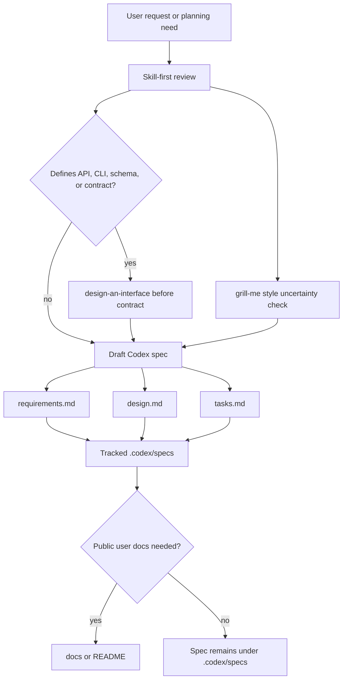

# Design Document

## Overview

Codex-generated planning documents become first-class project specs under `.codex/specs`. The directory is intentionally inside `.codex` because these files are agent workflow artifacts, but it is explicitly source-controlled because they are durable governance, not runtime memory.

The initial spec is:

```text
.codex/
  specs/
    codex-generated-documents/
      requirements.md
      design.md
      tasks.md
```

This mirrors the observed Kiro-like pattern from `H:\dev\company\GPTProxy\.kiro\specs\chatgpt-account-portal\`, while adapting the root from `.kiro/specs` to `.codex/specs`.

## Architecture



The system uses repository rules rather than a new runtime module. The convention is enforced through:

- `.gitignore` allowing `.codex/specs/**`.
- Root `AGENTS.md` instructing future agents where to write generated planning docs.
- Installer AGENTS template propagating the convention to generated global guidance.
- README documenting `.codex/specs` as durable specs distinct from memory/runtime artifacts.
- The task list recording T100 and Step 43 as the implementation trace.

## Components and Interfaces

### Spec Directory

`CodexSpecDirectory = .codex/specs/<feature-slug>/`

Rules:

- `<feature-slug>` is lowercase kebab-case.
- One slug represents one coherent feature, policy, migration, or change.
- The default files are `requirements.md`, `design.md`, and `tasks.md`.
- Additional files are allowed only when they are part of the same spec and do not duplicate the triple.

### Requirements Document

`requirements.md` captures:

- Introduction and problem framing.
- Glossary for stable terms.
- Requirements with user stories.
- EARS-style acceptance criteria.
- Grill-me uncertainty review, including self-answered questions and user-facing open questions.

### Design Document

`design.md` captures:

- Overview and architecture.
- Components and interfaces.
- Document model and lifecycle.
- Boundary rules against `docs/`, `.codex/memories`, `.codex/harness/tasks`, and `.codex/shared`.
- Risk and verification strategy.

### Tasks Document

`tasks.md` captures:

- Checkbox implementation plan.
- Requirement references for each task.
- Progress notes for unfinished tasks.
- Verification tasks and evidence requirements.

### Repository Rule Updates

The convention is copied into:

- `AGENTS.md` for repository-local behavior.
- `plugins/codex-memory/scripts/install_support.py` so generated global AGENTS guidance carries the same default.
- `README.md` for user-facing capability discovery.
- `docs/SKILL_ROUTING_AND_DEFAULT_GOVERNANCE.md` for skill-first document governance.

## Data Models

### CodexSpec

```text
CodexSpec {
  slug: kebab-case string
  root: ".codex/specs/<slug>/"
  requirements: "requirements.md"
  design: "design.md"
  tasks: "tasks.md"
  status: planned | doing | done | superseded
  source_request: short summary
  related_task_ids: list of docs/codex-memory-plugin-task-list IDs
}
```

### TaskProgressSummary

```text
TaskProgressSummary {
  task_id: string
  status: todo | doing | done | blocked
  recent_checkpoint_or_update: string | unknown
  completed_acceptance: list
  remaining_acceptance: list
  blockers: list
  next_step: string | unknown
  evidence_sources: list
}
```

## Boundary Rules

`.codex/specs` is for source-controlled agent planning specs.

`docs/` is for public or maintainer-facing documentation that should be read independently of an agent workflow.

`.codex/memories` is private runtime memory and remains untracked.

`.codex/harness/tasks` is task runtime state and remains untracked.

`.codex/shared` is source-controlled shared memory only after review; it is not the default home for requirements, design, or task specs.

`openspec/` remains the OpenSpec compatibility and change-governance area. New Codex-generated specs default to `.codex/specs` unless they are explicitly OpenSpec deltas or upstream governance artifacts.

## Decision and Blocker Analysis

- **Dependency:** `.gitignore` must allow `.codex/specs/**`; otherwise the new specs are invisible to normal Git tracking.
- **Decision:** The canonical current spec slug is `codex-generated-documents`.
- **Environment blocker:** `shrimp-task-manager` is not exposed in this runtime, so task tracking falls back to `docs/codex-memory-plugin-task-list.md`.
- **Interface blocker:** None. This task does not define a new API, CLI, schema, or cross-module contract, so `design-an-interface` is not required for this slice.
- **Verification blocker:** Full release verification is unnecessary for a docs/rule-only change; targeted diff, ignore, and Python syntax checks are sufficient unless committing triggers the full review gate.

## Verification Strategy

Targeted verification should confirm:

- `.codex/specs/codex-generated-documents/{requirements.md,design.md,tasks.md}` exists.
- `git status --short --untracked-files=all` shows `.codex/specs` files as trackable while leaving unrelated `.codex/shared` runtime files untouched.
- `git diff --check` passes for changed files.
- `py -X utf8 -m py_compile plugins/codex-memory/scripts/install_support.py` passes after template edits.

## Migration

Existing Codex-generated documents outside `.codex/specs` are not automatically moved by this slice. Future cleanup should be done per document after confirming whether each file is public documentation, OpenSpec material, or agent-only planning material.

New generated planning documents should use `.codex/specs/<feature-slug>/` immediately.
