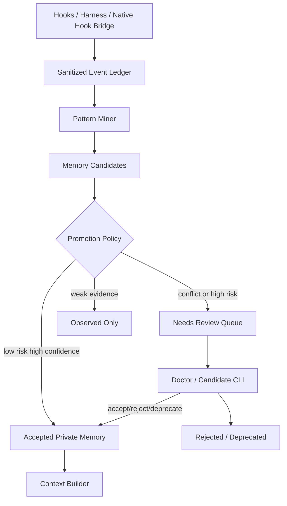

# 自动记忆挖掘方案

## 目标

自动记忆挖掘要解决的问题不是“任务结束时再写一段总结”，而是从多次历史交互中发现重复出现的用户习惯、项目工作流、纠正信号和高价值经验，并在后续任务中自动生效。

典型场景：

- 用户多次要求“直接用项目既有命令重启，不要先 stop 再 start”。
- 用户在同类仓库里反复要求“先 fetch 两个 remote，再判断 source of truth”。
- 某项目多次出现相同验证顺序、相同启动命令或相同提交边界。
- Agent 多次犯同一类错误，用户反复纠正。

这些信号在单次 `on_task_complete` 时不一定明显。自动记忆挖掘必须基于历史事件做低频后台分析，而不是要求用户每次手动整理。

## 非目标

- 不把所有历史对话原文长期保存成可检索知识。
- 不把低置信度候选直接写成强规则。
- 不把密钥、令牌、生产地址、私有内部链接、完整日志、完整 payload 或敏感业务数据写入记忆。
- 不让自动生成的个人偏好覆盖当前用户明确要求、项目 `AGENTS.md`、项目共享记忆或已验证的项目规则。
- 不依赖联网服务；第一版只使用本地 SQLite、JSONL、Markdown 和确定性规则。

## 当前缺口

当前系统已经具备：

- hook lifecycle：`before_task`、`after_tool`、`before_response`、`on_task_complete`。
- 项目私有 `.codex/memories`：task state、events、summary、distilled asset。
- 用户全局层与项目私有层隔离。
- 项目共享层 `.codex/shared` 的 promote、validate 和 index rebuild。
- 写入前敏感扫描。

当前缺少：

- 统一的历史事件账本 schema。
- 面向“重复习惯”的候选发现器。
- 候选置信度、证据链、自动接受和人工确认状态机。
- 自动把已接受偏好注入 context pack 的检索策略。
- 对误记、过期、冲突和撤销的治理命令。

## 总体架构

本节校正依据（2026-05-08 本地只读核对）：现有 lifecycle、存储、上下文和共享提升入口分别位于 `plugins/codex-memory/scripts/hook_runner.py`、`plugins/codex-memory/scripts/memory_store.py`、`plugins/codex-memory/scripts/context_builder.py`、`plugins/codex-memory/scripts/shared_memory.py`。



核心原则：

- hook 只负责记录脱敏事件，不在同步路径里做重挖掘。
- miner 低频运行，可由 `Stop`、任务完成、窗口启动或显式 doctor 触发。
- 自动写入只允许进入当前用户私有层或当前项目私有层。
- 项目共享层仍必须经过可审查 Markdown 与 validate 流程。

## 事件账本

新增事件账本不替代现有 `events.jsonl`，而是给历史挖掘提供稳定、最小、脱敏后的结构化输入。

建议存储：

```text
.codex/memories/history/events.jsonl
```

建议字段：

| 字段 | 说明 |
|---|---|
| `event_id` | 稳定 ID |
| `event_type` | `user_prompt`、`tool_command`、`agent_action`、`user_correction`、`task_complete` |
| `session_id` | Codex session 标识，缺失时使用可降级派生 ID |
| `task_id` | harness task id |
| `project_root` | 当前项目根 |
| `project_id` | workspace routing project id，可为空 |
| `scope` | `project`、`global`、`workspace`、`module` |
| `intent` | 归一化意图，例如 `restart_project`、`sync_remotes`、`review_gate` |
| `normalized_text` | 脱敏后的短摘要，不保存原始完整 prompt |
| `command_shape` | 命令模板，例如 `pwsh:start_backend.ps1 -Restart`，不含敏感参数 |
| `outcome` | `accepted`、`corrected`、`failed`、`succeeded` |
| `evidence_ref` | 指向 task summary、artifact 或 event 的最小引用 |
| `created_at` | UTC 时间 |

事件只保留可挖掘的结构化摘要。原始 tool output 和完整对话不进入该账本。

## 候选模型

本节校正依据（2026-05-08 本地只读核对）：当前结构化任务状态、summary、distilled asset 和 shared promote 的字段边界见 `plugins/codex-memory/scripts/task_spec.py`、`plugins/codex-memory/scripts/distillation_store.py`、`plugins/codex-memory/scripts/shared_memory.py`。

建议新增候选表或 JSONL：

```text
.codex/memories/history/candidates.jsonl
```

候选字段：

| 字段 | 说明 |
|---|---|
| `candidate_id` | 稳定 ID |
| `kind` | `workflow_preference`、`command_preference`、`correction_pattern`、`project_fact`、`verification_workflow` |
| `scope` | `project` 或 `global`，默认 project |
| `project_root` | 项目根 |
| `project_id` | workspace 子项目 ID |
| `statement` | 可注入上下文的简短记忆句 |
| `confidence` | `low`、`medium`、`high` |
| `risk` | `low`、`medium`、`high` |
| `support_count` | 支持事件数 |
| `contradiction_count` | 冲突事件数 |
| `last_seen_at` | 最近一次命中 |
| `status` | `observed`、`accepted`、`needs_review`、`rejected`、`deprecated` |
| `evidence_refs` | 证据引用数组 |
| `auto_promoted` | 是否自动接受 |

示例：

```json
{
  "kind": "command_preference",
  "scope": "project",
  "project_id": "backend-service",
  "statement": "重启本项目时优先使用既有 restart 命令，不拆成 stop/start 两步。",
  "confidence": "high",
  "risk": "low",
  "support_count": 4,
  "contradiction_count": 0,
  "status": "accepted",
  "auto_promoted": true
}
```

## 自动接受策略

本节校正依据（2026-05-08 本地只读核对）：记忆分层、共享提升和隐私边界见 `docs/MEMORY_LAYERING.md`、`docs/PRIVACY.md`、`plugins/codex-memory/scripts/sensitive_scan.py`。

用户希望自动化，因此不能把所有候选都变成手动待处理。第一版应采用保守自动接受：

| 类型 | 自动接受条件 | 默认 scope |
|---|---|---|
| `command_preference` | 同一项目内至少 3 次一致，最近 90 天内至少 2 次，无冲突，无敏感参数 | project |
| `workflow_preference` | 同一 intent 至少 3 次一致，且用户没有后续反向要求 | project |
| `correction_pattern` | Agent 同类错误被用户纠正至少 2 次，且修正方式一致 | project 或 global |
| `verification_workflow` | 同一项目验证命令顺序至少 3 次成功出现 | project |

必须进入人工确认或保持 `needs_review` 的情况：

- 涉及删除、覆盖、迁移、清理、发布、push、force、release。
- 涉及安全、凭据、网络上传、生产环境、内部链接。
- 与项目 `AGENTS.md`、`.codex/shared`、当前用户请求或已有 accepted memory 冲突。
- 证据来自单次长任务内部重复，而不是跨 turn 或跨 session 重复。
- statement 会改变代码审核、验证、提交或发布 gate 的强度。

自动接受的含义只是“后续作为个人/项目私有偏好注入上下文”，不是团队共享事实。要进入 `.codex/shared` 仍需 promote 和 review。

## 挖掘算法 MVP

本节校正依据（2026-05-08 本地只读核对）：当前项目已采用 SQLite、JSONL、summary 与本地检索组合，见 `plugins/codex-memory/scripts/init_storage.py`、`plugins/codex-memory/scripts/retrieval_store.py`、`docs/MEMORY_RETRIEVAL_STRATEGY.md`。

第一版用确定性规则，不上向量数据库：

1. 归一化事件。
   - 路径归一化。
   - 命令模板化。
   - prompt 提取 intent。
   - 敏感字段脱敏。

2. 按 `scope + project_root + project_id + intent + command_shape` 聚类。

3. 计算分数。

```text
score =
  support_count * 2
  + unique_session_count * 3
  + successful_outcome_count
  + recency_bonus
  - contradiction_count * 5
  - risk_penalty
```

4. 生成或更新候选。

5. 根据 promotion policy 设置状态：
   - `accepted`
   - `needs_review`
   - `observed`
   - `deprecated`

6. 写入候选索引，并在 before_task context pack 中注入 accepted 且相关的候选。

## 自动触发时机

推荐触发点：

| 时机 | 动作 | 同步要求 |
|---|---|---|
| `UserPromptSubmit` | 记录 prompt 摘要事件 | 必须快 |
| `PostToolUse` | 记录命令模板、结果摘要和 touched paths | 必须快 |
| `Stop` / `on_task_complete` | 对当前 task 做轻量增量挖掘 | 可降级 |
| `on_session_start` / doctor | 扫描 stale candidates 和冲突 | 可降级 |
| 显式维护命令 | 全量回扫最近 N 天历史 | 手动触发 |

自动挖掘失败不能阻断 Codex 正常工作。失败时只写 degraded reason 到工具简报或 doctor 输出。

## 上下文注入

accepted candidate 进入 context pack 时必须带来源和置信度，且遵守优先级：

1. 当前用户明确要求。
2. 项目 `AGENTS.md` 和当前仓库规则。
3. 项目共享层 `.codex/shared`。
4. 当前任务 state 和显式 constraints。
5. 自动接受的项目私有偏好。
6. 自动接受的用户全局偏好。
7. 低置信 observed candidate 仅可作为提示，不可作为规则。

注入格式示例：

```text
## Learned Preferences
- [project/high] 重启本项目时优先使用既有 restart 命令，不拆成 stop/start 两步。
  Evidence: 4 events across 3 sessions. Last seen: 2026-05-08.
```

如果当前用户本轮说“这次先 stop 再 start”，必须覆盖历史偏好。

## CLI 与用户体验

本节校正依据（2026-05-08 本地只读核对）：现有命令分流入口和 doctor/init/promote/shared 命令面位于 `plugins/codex-memory/scripts/codexm.ps1`、`plugins/codex-memory/scripts/codex_bootstrap.py`、`plugins/codex-memory/scripts/shared_memory.py`。

用户不需要每次手动整理，但需要有可检查、可撤销入口：

```powershell
codex memory mine status
codex memory mine run --recent 90d
codex memory candidates list
codex memory candidates show <candidate-id>
codex memory candidates accept <candidate-id>
codex memory candidates reject <candidate-id>
codex memory candidates deprecate <candidate-id>
```

日常默认：

- 自动记录事件。
- 自动挖掘低风险高置信偏好。
- 自动注入 accepted 偏好。
- 只在冲突、高风险或低置信时提示用户。

doctor 应展示：

- 自动挖掘是否启用。
- 最近一次挖掘时间。
- accepted / needs_review / observed 数量。
- 最近 degraded reason。
- 是否存在与强规则冲突的候选。

## 安全与隐私

本节校正依据（2026-05-08 本地只读核对）：写入前敏感扫描、隐私边界和 release zip 排除边界见 `plugins/codex-memory/scripts/sensitive_scan.py`、`docs/PRIVACY.md`、`scripts/build_release.py`。

自动化不能降低安全边界：

- 所有事件和候选写入前执行敏感扫描。
- 命令参数默认只保留 shape，不保留疑似 secret 或路径外敏感值。
- 内部链接、生产地址、私有仓库地址默认不写入 statement。
- high risk candidate 不自动接受。
- 用户可按 `task_id`、`session_id`、`project_root` 删除历史事件和候选。
- release zip 继续排除 `.codex/memories/**`、history 目录、SQLite、JSONL 和 distilled runtime。

## 验收标准

本节校正依据（2026-05-08 本地只读核对）：当前项目验证闭环、任务清单和 grounded docs 检查入口见 `scripts/verify_project.py`、`docs/codex-memory-plugin-task-list.md`、`scripts/verify_grounded_docs.py`。

自动记忆挖掘能力完成时，至少满足：

1. 多次重复的低风险项目习惯能自动成为 accepted project private memory。
2. accepted memory 会在相关任务开始时自动注入 context pack。
3. 高风险、冲突、低证据候选不会自动生效。
4. 用户可以查看、撤销、拒绝和弃用候选。
5. 敏感扫描覆盖事件账本、候选、summary 和 shared promote。
6. 支持按 task/session/project 删除历史挖掘数据。
7. 自动挖掘失败不会阻断主任务，会输出降级原因。

## 分阶段任务

### Phase AM-1：事件账本

- 新增历史事件 schema。
- 在 hook bridge / hook runner 中写入脱敏事件摘要。
- 单测覆盖 prompt、tool command、correction 和 task complete。

### Phase AM-2：候选挖掘器

- 新增 deterministic pattern miner。
- 支持 command preference、workflow preference、correction pattern。
- 输出 candidates，并计算 confidence/risk/status。

### Phase AM-3：自动提升策略

- 实现 promotion policy。
- 低风险高置信自动 accepted。
- 高风险、冲突和低证据进入 needs_review 或 observed。

### Phase AM-4：上下文注入

- context builder 读取 accepted candidates。
- 注入时按 project_id、intent、working_set 和 scope 过滤。
- 冲突时以当前用户请求和项目强规则优先。

### Phase AM-5：治理命令与清理

- 增加 `codex memory mine ...` 与 `codex memory candidates ...`。
- 增加按 task/session/project 删除。
- doctor 输出自动挖掘状态。

### Phase AM-6：共享提升衔接

- accepted private memory 可生成 `.codex/shared` 草稿。
- shared promote 仍需 validate 和 review。
- 项目共享层不接受未审查的自动候选直接写入。
