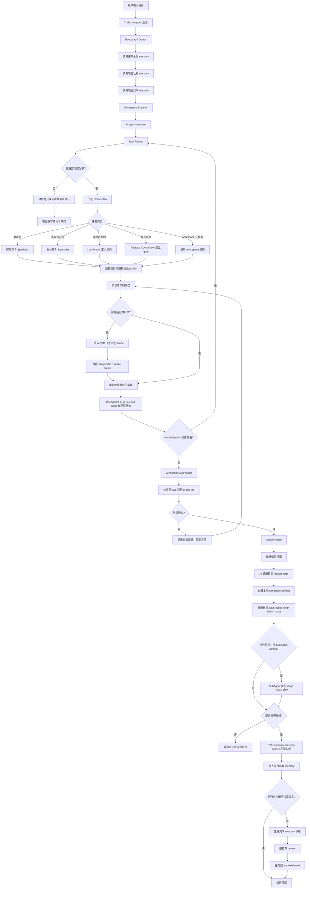

# 完整实现后的开发流程

## 1. 文档定位

本文描述 Codex Memory Harness 全部规划能力实现后的目标开发流程。

它不是当前运行时能力声明。当前仓库已经具备 memory、harness、verification、敏感信息扫描、项目共享 memory promote、workspace routing schema、只读 scanner、只读 route planner、最小 verification aggregation、SubAgent binding/scope guard/coordinator summary/dispatch plan、游戏客户端 profile 模板、基础 AI 诊断日志 release gate 和 lifecycle 软集成的本地 MVP，但真实 SubAgent 自动执行器和发布级完整验证平台仍在路线中。

## 2. 完整能力假设

完整实现后，系统应具备这些能力：

- 启动时自动 bootstrap、doctor，并初始化缺失的项目 harness 配置。
- 自动扫描 workspace，形成 project inventory。
- 根据用户请求、cwd、diff、working set、memory 和显式配置生成 route plan。
- 为不同 SubAgent 绑定 project、domain、cwd、scope、rules 和 verification profile ids。
- 支持 coordinator 汇总跨项目契约、验证结果、冲突和发布顺序。
- 支持 AI 诊断日志统一开关，开发期可临时开启，release 必须关闭。
- 支持把 Codex CLI xhigh review gate 委托给 XHigh Review Runner SubAgent 并行执行，按 stdout/stderr 和状态进度观察，不再套固定总时长；最终审核语义来自候选提交后的固定 review base，首次单提交候选可用 `codex xhigh review --base HEAD~1`，修复循环必须继续使用同一个 `<candidate-base>`。
- 支持 review preflight、diff fingerprint、review ledger、findings loop 和 slice planner，降低最终 gate 的重复失败和无效等待。
- 支持 session-worktree binding：写任务开始时获得明确 `effective_cwd`，并发写同一项目时自动隔离到 managed worktree。
- 支持多项目 verification aggregation，每个子项目可使用自己的 cwd 和 profile。
- 支持 scope guard、敏感信息扫描、裸日志检查和 release gate。
- 支持项目私有 memory、用户全局 memory、项目共享 memory 的分层写入。

### 2.1 第一阶段职责边界

“第一步”在不同层级含义不同，不能混为一个动作：

| 层级 | 第一动作 | 当前处理状态 | 说明 |
|---|---|---|---|
| Codex 窗口启动 | PowerShell/POSIX shell wrapper 执行 bootstrap / doctor，必要时初始化缺失项目配置 | 已自动处理 | 仅限经过 `codex` / `codexm` wrapper 的 shell 启动；`codex-raw` 或非 wrapper 启动不会自动执行 |
| Harness 任务生命周期 | `codex harness start` 触发 `before_task` | 已实现运行时能力 | wrapper 只负责窗口启动，不能单独理解每条用户任务；任务开始仍需要 agent、hook 或自动化调用 harness/controller |
| Workspace 路由 | `before_task` 生成 route plan 和 SubAgent bindings | 已做 lifecycle 软集成 | route plan/bindings 写入 task metadata；低置信度会降级为只读分析或提示确认 |
| Session worktree | 写任务绑定 primary checkout 或 managed worktree | 已实现最小 runtime | 已有 `codex workspace session ...`、`worktree list` 和 `write-guard`；后续仍需宿主级 `before_first_write` 强制拦截、stale cleanup 和多 session 合并 |
| SubAgent 执行 | 按 binding 绑定 project/domain/cwd/scope/rules/profile | 已实现 binding 和 dispatch plan，不自动执行 | 当前不会自动创建真实 SubAgent；`codex workspace schedule` 只生成可执行计划，宿主或主 agent 使用 SubAgent 时必须带上对应 binding |
| 发布/提交后 review gate | 聚合验证、scope guard、敏感扫描、诊断日志 release gate、candidate commit、固定 base 的 `codex xhigh review --base <candidate-base>` | 部分实现 | 验证聚合、scope guard、敏感扫描、基础诊断 release gate、review preflight、commit diff fingerprint、ledger、runner 恢复和 slice planner 已有；仍不是覆盖渠道包、热更、平台配置和回滚材料的完整发布平台 |

因此，当前“第一步”已经覆盖启动自检和任务路由软集成，但还没有做到只靠 wrapper 自动捕获并编排所有用户任务。

## 3. 用户体感流程

用户不需要手动选择“客户端、服务器、后台、文档、美术工程”。正常输入任务即可。

例如：

```text
修一下活动入口，客户端入口要按服务端配置显示，后台配置页也同步一下。
```

完整实现后，Codex 应自动判断这不是单文件修复，而是跨客户端、服务器配置、后台页面和文档的综合任务。

用户看到的流程应是：

1. Codex 识别涉及哪些子项目和风险。
2. 写任务先绑定 primary checkout 或 managed worktree，并得到 `effective_cwd`。
3. Codex 给出 route plan 和验证计划。
4. Coordinator 拆分任务，必要时分配 SubAgent。
5. 各 SubAgent 只处理自己的项目、scope 和绑定 worktree。
6. 需要运行反馈时，临时开启对应 scope 的 AI 诊断日志。
7. 修改完成后自动聚合验证。
8. 代码变更先通过 review preflight 和验证，再创建本地 candidate commit；随后记录首次候选提交的父提交作为 `<candidate-base>`，并通过 `codex xhigh review --base <candidate-base>` 审核完整候选范围。大 diff 或长耗时审查优先由 XHigh Review Runner SubAgent 作为命令执行器并行运行该 gate，持续有输出时不按固定总时长失败，也不得再套任何外层总时长。
9. Release gate 检查诊断日志关闭、敏感信息、scope 越权和构建边界。
10. 如果 review 本次提交发现阻断问题，Codex 修复后创建新的本地提交或在未 push 前重做候选提交，并重新 review 最新提交，直到没有新的阻断问题。
11. Codex 给出最终 summary、验证证据、发布顺序和回滚说明。
12. 稳定结论写入项目私有 memory；可共享事实经 review 后提升到项目共享层。

## 4. 总流程图



## 5. 实现循环

实现阶段不是一次性改完，而是小步闭环。

每个实现循环包含：

1. 读取 route binding、项目规则和相关 memory。
2. 修改最小必要文件。
3. 如需要反馈，开启限定 scope 的 AI 诊断日志。
4. 运行 quick、diagnostic、smoke 或项目专用 profile。
5. 把失败证据、日志摘要、touched paths 写入 checkpoint。
6. 如果 touched paths 扩大到其他项目，回到 Task Router 重新路由。
7. 如果验证通过，进入聚合验证和 gate。
8. 对代码变更先运行 review preflight；preflight 失败时先修确定性问题，不启动 xhigh review。
9. 验证通过后先创建本地 candidate commit，并记录 `<candidate-base>..HEAD` 的 commit diff fingerprint；首次 `<candidate-base>` 通常来自 `git rev-parse HEAD~1`。
10. 运行 `codex xhigh review --base <candidate-base>`；大 diff 或长耗时审查优先派发 XHigh Review Runner SubAgent 执行该命令，按 stdout/stderr 和状态进度观察，不再套固定总时长。SubAgent 自行审查只作为专题辅助，不替代 Codex CLI xhigh review gate。
11. 如果 review findings 指向本次候选范围，先修复，再创建新的本地提交或在未 push 前重做候选提交，然后用同一个 `<candidate-base>` 重新 review 到最新 HEAD 的完整候选范围；若工作树包含用户无关改动，只提交本轮相关文件。

## 6. SubAgent 分工

Specialist SubAgent 只处理单个 route binding。例如 Unity UI、Go 服务器协议、后台配置页或文档更新。

Coordinator SubAgent 管跨项目事务。它不应吞掉所有实现，而应负责契约、分工、验证聚合、冲突处理、发布顺序和最终总结。

XHigh Review Runner SubAgent 只负责运行固定 base 的 `codex xhigh review --base <candidate-base>` 或明确的降级命令，不修改文件、不提交，也不替代专题 Reviewer。

每个 SubAgent 的输出必须包含：

- `project_id`
- `domain`
- `cwd`
- `assigned_scope`
- `touched_paths`
- `verification_profile_ids`
- `diagnostic_logging` 使用情况
- 未验证项和风险

## 7. AI 诊断日志位置

AI 诊断日志只存在于实现和验证循环中。

它的作用是让 AI 看到流程是否按预期运行，例如状态机、资源加载、网络分支、热更新、UI 生命周期和平台差异。

它不能进入最终发布包，也不能把原始日志写入 memory。

完整目标态的 Release gate 必须检查；当前 runtime 只内建基础 AI 诊断日志 release gate，构建、版本、热更、回滚材料和平台配置仍需要业务项目自己的 release profile 覆盖：

- 诊断开关已关闭。
- 调试宏或 define 未启用。
- 临时 sink 未启用。
- 没有新增裸日志绕过统一门面。
- 敏感字段没有被输出。

## 8. 验证与发布 gate

验证分为三层：

| 层级 | 目的 | 示例 |
|---|---|---|
| Specialist 验证 | 验证单项目改动 | `client_quick`、`server_unit`、`admin_lint_test` |
| Coordinator 聚合 | 验证跨项目契约和顺序 | contract test、integration、docs consistency |
| Release gate | 验证发布边界 | 目标态覆盖构建、版本、热更、回滚、诊断日志关闭、敏感扫描；当前本仓库只提供基础诊断日志 gate 和验证聚合能力 |

任何一层失败，都不能假装完成。最终答复必须说明失败项、阻断程度和下一步。

## 9. Memory 沉淀

任务完成后，系统按分层写入：

| 层级 | 写入内容 |
|---|---|
| 用户全局层 | 跨项目长期偏好和通用工作流 |
| 项目私有层 | 本地任务 summary、验证结果、低置信草稿和运行态 |
| 项目共享层 | 团队确认的稳定事实、架构决策、流程和路由规则 |

原始日志、完整构建输出、密钥、生产地址、渠道配置和原始资产都不能写入 memory。

项目共享层只能由 promote 流程生成草稿，再经过脱敏和 review 后提交。

## 10. 典型场景

### Quick Fix

小 bug 或小文案改动会走单项目路由。

系统加载该项目规则，执行最小修改，运行 quick profile，写入 summary。通常不需要 SubAgent 并行，也不需要项目共享 memory。

### Feature Story

单个玩法、UI 或资源链路会走 Feature Story。

系统需要确认验收条件、资源影响、平台影响和回归点。必要时开启 AI 诊断日志验证流程和状态。

### Cross Project Contract

客户端、服务器、后台或文档共同参与时，先由 coordinator 定义契约。

契约稳定后再分配 specialist。最终必须聚合验证，并输出发布顺序和回滚方式。

### Release Train

发版、热更、渠道包或服务器部署会走 release coordinator。

此时不能只看代码测试是否通过，还要检查版本号、构建产物、资源清单、渠道配置、诊断日志关闭、敏感信息和回滚材料。

## 11. 当前落地差距

当前仓库已经有这些基础：

- memory 分层设计。
- harness start/checkpoint/complete。
- verification runner。
- workspace routing 文档设计。
- workspace routing schema 和项目配置模板。
- 只读 workspace scanner 和 `codex workspace doctor/scan`。
- 只读 route planner 和 `codex workspace route`。
- 最小 workspace verification aggregation 和 `codex workspace verify`。
- SubAgent route binding、scope guard、coordinator summary 和 dispatch plan 的最小运行时。
- 游戏客户端 Unity/Laya/Cocos profile 模板生成器。
- 基础 AI 诊断日志 release gate runtime。
- `before_task` / `after_tool` / `before_response` 的 workspace routing 软集成。
- workspace memory 自动分层写入 proposed shared drafts。
- review gate preflight、diff fingerprint、review ledger、findings loop 和 slice planner runtime。
- `workspace_meta` 根工具工程识别和根路径路由。
- SubAgent 角色协议文档。
- AI 诊断日志策略文档。
- 写入前敏感信息扫描器。
- 项目共享 memory promote、validate 和 index rebuild。
- 自动历史记忆挖掘、review gate 优化和 session-worktree 绑定的方案文档。

仍需实现：

- 真实 SubAgent 自动执行器。
- 发布级完整验证平台。
- 自动历史记忆挖掘 runtime。
- session-worktree 宿主级强制 lifecycle、stale cleanup 和多 session 合并。
