# LLM、Agent 与 Codex Memory Harness 使用手册

## 1. 页面定位

这是一篇面向普通使用者和项目维护者的解释型手册。

它不从命令开始，而是先解释大模型、Token、向量表示、Agent、Codex 工作流和记忆系统。读者理解这些基础后，再看 Codex Memory Harness 的安装、使用和验证闭环，会更容易判断它解决的到底是什么问题。

一句话概括：

```text
LLM 负责理解和生成，Agent 负责把模型接到工具和项目上，Memory Harness 负责把任务过程、项目约束、验证证据和可沉淀结论保存到本机可审计的外部记忆里。
```

先看总览图：

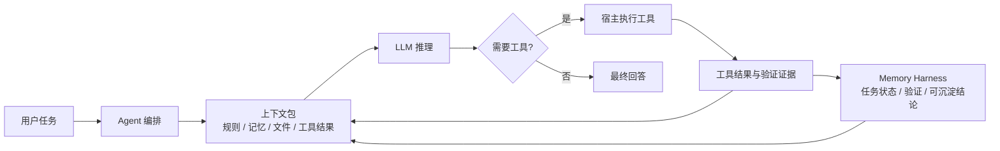

这张图表达的是：模型只负责基于当前上下文推理；工具由宿主执行；Memory Harness 负责把过程状态和验证证据保存在模型外部，并在后续需要时重新装配进上下文。

读完这篇手册后，应该能回答八个问题：

- Token、词向量和上下文预算之间是什么关系。
- OpenAI Prompt Caching 是什么、为什么命中相同前缀会降低延迟和成本。
- Token 为什么会限制 Agent 的上下文能力。
- LLM、Agent、工具调用和宿主程序之间是什么关系。
- Codex 做代码任务时，一次请求里大概包含哪些内容。
- Agent 的“返回”为什么不只是最终文本，还可能是工具调用。
- 临时记忆、工程记忆和 RAG 分别解决什么问题。
- Codex Memory Harness 为什么要做记忆分层、验证回写和任务生命周期。

## 2. 先理解 Token

本节校正依据（2026-05-06 只读核对）：OpenAI Tokenizer 与 Prompt Caching 文档：`https://platform.openai.com/tokenizer`、`https://developers.openai.com/api/docs/guides/prompt-caching`

先把 Token、向量、prefill 和输出放在一条线上看：

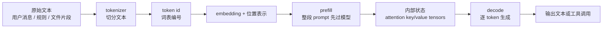

这一节后面的表格和说明，都是在解释这张图里每个节点的边界。

### 2.1 Token 是什么

Token 是大模型处理文本时使用的离散文本单位。它不完全等于一个字、一个词或一个字符，也不是词向量本身。

更准确地说，模型处理文本前通常会经历这条链路：

```text
原始文本 -> tokenizer 切分 -> token id -> 向量表示 -> Transformer 推理
```

Token 位于“切分”和“编号”这一层。向量表示位于后面的模型计算层。

例如：

```text
修复登录按钮样式
```

模型不会直接把这句话当作一个整体处理，而是会先由 tokenizer 切成若干 token。一个 token 可能短到单个字符，也可能长到一个常见词或子词；中文、英文和代码的切分都取决于具体模型使用的 tokenizer，不能稳定按“一个汉字”“一个英文词”来估算。代码里的符号、缩进、路径、变量名也会占 token。

例如 `苹果` 和 `apple` 语义相近，但通常不会被 tokenizer 编码成相同的 token 序列。它们会先变成不同 token id，再在模型内部变成向量。模型能把它们联系起来，是训练后学到的语义关系，不是 token 天然相同。

因此不要把三件事混在一起：

| 概念 | 它是什么 | 常见误解 |
|---|---|---|
| Token | tokenizer 切出的离散文本单位 | 一个 token 就是一个词 |
| Token id | token 在词表里的编号 | 编号本身有语义 |
| 向量表示 | token id 进入模型后的连续数值表示 | 语义相近就一定是同一个 token |

在工程使用中，可以把 token 理解成模型的输入和输出预算单位：

- 用户输入会消耗 token。
- 系统规则会消耗 token。
- 项目文档会消耗 token。
- 代码片段会消耗 token。
- 工具输出会消耗 token。
- 模型最终回答也会消耗 token。

### 2.2 为什么 Token 重要

Agent 做工程任务时，不只是读用户一句话。一次请求里通常会包含：

- 系统规则。
- 项目 `AGENTS.md`。
- 用户当前任务。
- 历史对话摘要。
- 相关代码片段。
- 工具调用结果。
- 记忆检索结果。
- 安全和输出格式约束。

这些内容进入模型上下文前，都会被切成 token。上下文越长，消耗的 token 越多。即使模型支持很长上下文，也不能无限塞入全部仓库、全部日志和全部历史。

Token 预算限制的不是“模型有没有语义理解能力”，而是“本次请求能带多少材料”。材料没有放进当前上下文，模型就不能稳定使用。

所以工程化 Agent 必须解决一个问题：

```text
在有限 token 预算里，应该放入哪些上下文，舍弃哪些上下文，哪些历史需要外部存储，什么时候再检索回来。
```

这就是记忆系统、检索系统和上下文编排存在的原因。

### 2.3 一次 Agent 请求里的 Token 去向

一次 Codex 请求不是只有用户输入的一句话。为了让模型能安全、准确地执行工程任务，宿主通常会把多类上下文一起交给模型。

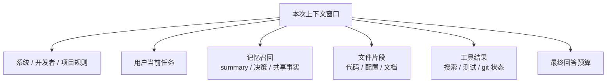

| Token 去向 | 示例 | 为什么需要 |
|---|---|---|
| 系统和安全规则 | 不能泄露密钥、不能执行危险命令 | 保证 Agent 行为边界 |
| 开发者规则 | 先读代码再改、最终说明验证情况 | 保证工程质量 |
| 项目规则 | `AGENTS.md`、输出语言、提交要求 | 保证符合项目约定 |
| 用户任务 | 当前用户真正要做的事 | 定义目标 |
| 历史摘要 | 前面几轮对话压缩后的结论 | 保持短期连续性 |
| 记忆召回 | 任务 summary、项目决策、共享事实 | 保持跨窗口连续性 |
| 文件片段 | 相关代码、配置、文档 | 给模型真实证据 |
| 工具结果 | 搜索结果、测试输出、git 状态 | 让模型根据最新状态继续行动 |
| 最终回答 | 改动总结、验证、风险 | 交付给用户 |

这些内容最终都会变成 token 预算的一部分。向量库或外部记忆可以帮助检索材料，但被选中的材料仍然要回到当前上下文里，模型才能使用。

Token 预算紧张时，不能简单把所有内容都塞进去。更好的做法是：

- 当前任务目标和硬约束必须优先保留。
- 项目规则优先于个人偏好。
- 最近工具结果优先于旧工具结果。
- 相关文件片段优先于完整文件。
- 验证摘要优先于完整日志。
- 已审查共享记忆优先于低置信草稿。

### 2.4 Token、上下文窗口和外部记忆的关系

可以把这些概念理解成不同层次：

| 概念 | 作用 | 类比 |
|---|---|---|
| Token | 当前请求里文本的切分和预算单位 | 每次能带多少材料 |
| 向量表示 | token 进入模型或检索系统后的数值表示 | 材料进入计算系统后的编码 |
| OpenAI Prompt Caching | 复用相同 prompt 前缀的已处理结果 | 上次处理过的共同开头 |
| 上下文窗口 | 当前请求能容纳的 token 总量 | 当前会议桌能摊开的资料 |
| 外部记忆 | 不放在当前 prompt 里、需要时再取回的资料 | 文件柜、任务记录、项目档案 |

外部记忆不是替代上下文窗口。模型每次推理时仍然只能看见当前上下文里的内容。外部记忆的价值在于：先把历史和状态存好，需要时再检索、摘要、筛选，然后放回当前上下文。

也就是说，外部记忆解决的是“哪些材料值得拿回来”，上下文窗口解决的是“这次最多能放多少材料”，token 是两者共同面对的预算单位。

### 2.5 每一步用了什么技术

这条链路不是一个单一算法，而是多个技术层串起来：

```text
原始文本 -> tokenizer 切分 -> token id -> 向量表示 -> Transformer 推理 -> 输出
```

逐步看：

| 步骤 | 常见技术 | 做了什么 |
|---|---|---|
| 原始文本 | Unicode、UTF-8、消息模板、prompt 拼接 | 把用户消息、规则、工具结果和文件片段整理成文本 |
| tokenizer 切分 | BPE、Byte-level BPE、WordPiece、Unigram / SentencePiece、正则预切分 | 按模型词表规则把文本切成 token |
| token id | 词表 vocabulary、特殊 token、整数编码 | 把每个 token 映射成词表里的整数编号 |
| 向量表示 | embedding table lookup、位置编码 / 位置表示、消息或角色边界标记 | 把 token id 查表成向量，并加入位置信息；角色边界通常由宿主消息模板或模型协议决定 |
| Transformer 推理 | self-attention、multi-head attention、FFN / MLP、归一化层、残差连接 | 让 token 和上下文里的其他 token 交互，计算下一步表示 |
| 输出 | logits、softmax、采样 / 解码策略、temperature、top-p、停止条件 | 从概率分布里选择下一个 token，再解码成文本或工具调用 |

`tokenizer` 不是神经网络推理的一部分，它通常是确定性的文本编码器。同一段文本、同一个 tokenizer 版本、同一组编码选项，通常会得到同一组 token id。实际计数应使用目标模型对应的 tokenizer 或官方 tokenizer 工具确认。

`embedding table lookup` 更像查表，不是先理解语义再生成向量。语义关系主要是在大量训练中，通过 Transformer 的参数和上下文计算学出来的。

`Transformer 推理` 是主要计算成本所在。它会反复使用注意力机制和前馈网络，把 token 序列变成下一 token 的概率分布。

最终输出仍然是 token。模型每生成一个新 token，通常都会把它接回已有序列，再继续预测下一个 token，直到遇到停止条件。

### 2.6 OpenAI Prompt Caching 在哪一步

这里的缓存只指 OpenAI API 文档里的 Prompt Caching。

完整链路仍然可以简化成：

```text
原始文本 -> tokenizer 切分 -> token id -> 向量表示 -> Transformer 推理 -> 输出
```

Prompt Caching 发生在服务端处理 prompt 的阶段。它不会把最终回答缓存起来，也不会让模型跳过输出生成；它复用的是先前请求里相同 prompt 前缀已经处理过的部分，从而减少再次处理长前缀的成本和延迟。官方文档说明，它面向长 prompt 场景，可把延迟最高降低约 80%，把输入 token 成本最高降低约 90%。

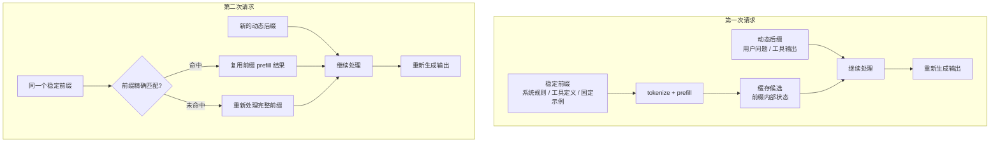

官方文档给出的核心机制如下：

| 阶段 | 发生什么 |
|---|---|
| 支持范围 | 官方文档写明 Prompt Caching 面向所有 recent models、`gpt-4o` 及更新模型启用 |
| 触发条件 | prompt 至少 1024 tokens 时自动启用；不需要额外代码或单独付费 |
| 前缀匹配 | 只有 prompt 开头部分完全一致，才可能命中缓存 |
| 路由 | 请求会根据 prompt 初始前缀的哈希路由到近期处理过相同前缀的机器；如提供 `prompt_cache_key`，它会和前缀哈希一起影响路由 |
| 查找 | 服务端检查所选机器上是否已有这个 prompt 前缀的缓存 |
| 命中 | 找到匹配前缀时，复用已处理结果，降低延迟和输入 token 成本 |
| 未命中 | 没有匹配前缀时，完整处理本次 prompt，并把前缀留给后续相同前缀请求复用 |
| 观测 | 响应的 `usage.prompt_tokens_details.cached_tokens` 会显示本次命中了多少 prompt tokens；小于 1024 tokens 的请求也会显示该字段，但值为 0 |

Prompt Caching 的关键是“相同前缀”，不是“语义相似”。如果把稳定内容放在前面，把每次变化的用户问题、时间戳、临时文件片段或工具结果放在后面，就更容易命中缓存。对 Agent 来说，适合放在前面的通常是系统规则、稳定工具定义、固定示例和长期不变的项目约束；频繁变化的用户输入、检索结果和工具输出应尽量靠后。

可缓存的内容不只普通消息。官方文档明确提到，完整 messages、图片、工具列表和结构化输出 schema 都可能参与缓存；图片的 `detail` 等会影响 tokenization 的参数必须保持一致，工具列表也必须在请求之间相同，才有机会形成相同前缀。

Prompt Caching 有两种保留策略：

| 策略 | 含义 |
|---|---|
| `in_memory` | 对支持该策略的模型，缓存前缀通常在 5 到 10 分钟不活跃后失效，最长可到 1 小时；缓存只保存在易失 GPU 内存中 |
| `24h` | 扩展保留策略，让缓存前缀最长保留 24 小时；可用模型以官方文档为准 |

扩展保留策略的原理不是把原始 prompt 文本长期落盘。官方说明是：当内存不足时，系统会把 prefill 阶段由 attention 层产生的 key/value tensors 卸载到 GPU-local storage，以增加可用于缓存的容量；原始客户内容（例如 prompt 文本）只保留在内存中。

这也解释了几个边界：

- Prompt Caching 不改变最终输出 token 的生成，API 仍会基于完整 prompt 重新计算本次回答。
- Prompt Caching 不是长期记忆，不能用来保存事实、决策、任务状态或验证证据。
- Prompt Caching 不能手动清空；近期未再次遇到的 prompt 会自动过期。
- Prompt Caching 不会绕过 TPM 等速率限制。
- 缓存不跨组织共享；相同组织内的相同 prompt 才可能访问相同缓存。
- 如果相同前缀加 `prompt_cache_key` 的组合请求速率过高，部分请求可能溢出到其它机器，降低缓存效果；官方 best practices 建议每个组合保持在约 15 requests/minute 以下。

最小示例：

```json
{
  "model": "gpt-5.5",
  "input": "这里放稳定前缀，然后把变化内容放在末尾。",
  "prompt_cache_retention": "24h"
}
```

命中情况看响应里的 usage：

```json
"usage": {
  "prompt_tokens": 2006,
  "prompt_tokens_details": {
    "cached_tokens": 1920
  }
}
```

本节校正依据（2026-05-06 只读核对）：

- OpenAI Prompt Caching：`https://developers.openai.com/api/docs/guides/prompt-caching`

## 3. LLM 是怎么工作的

本节校正依据（2026-05-06 只读核对）：OpenAI Text Generation、Tools 与 hallucination 说明：`https://platform.openai.com/docs/guides/text`、`https://platform.openai.com/docs/guides/tools`、`https://openai.com/index/why-language-models-hallucinate/`

### 3.1 LLM 的基本输入输出

从最简化角度看，LLM 的一次调用像这样：

```text
输入：一组消息、规则、上下文和用户问题
输出：文本、结构化数据，或在启用工具时输出一个需要宿主执行的工具调用请求
```

这些输入在进入模型前会被切成 token，再映射成向量表示。模型不是直接处理“词”的语义标签，而是在 token 序列的向量表示上计算下一步。

它不是在数据库里查答案，也不是天然知道你的本地项目状态。它根据当前上下文、模型参数和解码设置生成输出；如果要使用外部事实、本地文件或实时信息，必须由宿主把相关材料或工具结果放进上下文。

### 3.2 LLM 擅长什么

在上下文充分、任务边界清楚、验证机制到位时，LLM 通常擅长：

- 总结信息。
- 解释代码。
- 生成代码。
- 重构局部逻辑。
- 根据错误信息提出候选原因。
- 把自然语言需求转换成步骤。
- 在多个约束之间做权衡。

### 3.3 LLM 的天然限制

LLM 也有天然限制：

- 它只能稳定使用本次上下文里提供的信息。
- 它不天然拥有你的项目长期记忆。
- 它不会自动知道本机刚刚运行过什么命令。
- 它不能凭空保证代码已经通过测试。
- 它可能生成看起来合理但不真实的内容，也可能把低置信推断说得很像事实。
- 它可能在长任务中丢失早期约束。
- 它的输入输出都受 token 预算限制。

因此，只靠 LLM 本身并不等于拥有一个可靠的工程助手。工程助手还需要工具、状态、验证和记忆。

本节校正依据（2026-05-06 只读核对）：

- OpenAI Text Generation：`https://platform.openai.com/docs/guides/text`
- OpenAI Tools：`https://platform.openai.com/docs/guides/tools`
- OpenAI Why language models hallucinate：`https://openai.com/index/why-language-models-hallucinate/`
- IBM Large Language Models：`https://www.ibm.com/think/topics/large-language-models`
- Google Cloud Large Language Models：`https://cloud.google.com/ai/llms`

## 4. Agent 是什么

本节校正依据（2026-05-06 只读核对）：OpenAI Agents SDK 与 Function Calling / Tools 文档：`https://platform.openai.com/docs/guides/agents-sdk`、`https://platform.openai.com/docs/guides/function-calling`

### 4.1 从 LLM 到 Agent

一次裸 LLM 调用主要根据输入生成输出。这里说的工程 Agent，则是把模型接到外部工具、状态管理、权限边界和任务循环上的系统。

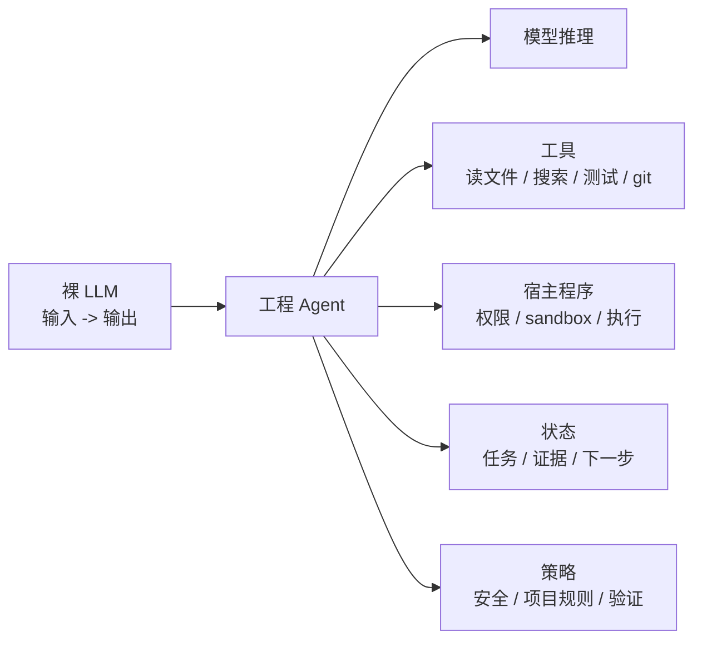

一个工程 Agent 通常具备这些能力：

- 读取文件。
- 搜索代码。
- 修改文件。
- 运行测试。
- 查看 git 状态。
- 调用诊断脚本。
- 根据工具结果继续决策。
- 在最终回答里说明改了什么、验证了什么、还剩什么风险。

所以工程 Agent 不是一个单独的模型，而是一套由模型、工具、宿主程序、状态和策略共同组成的循环：

```text
用户任务 -> 构建上下文 -> 模型推理 -> 工具调用 -> 观察结果 -> 再推理 -> 再行动 -> 总结回复
```

### 4.2 Agent 的一次请求可以拆成什么

一次 Agent 请求通常包含以下部分：

| 部分 | 作用 |
|---|---|
| 系统规则 | 定义模型身份、安全边界、工具使用规则 |
| 开发者规则 | 定义工程行为、输出格式、测试要求、协作方式 |
| 项目规则 | 来自 `AGENTS.md`、项目文档和本地配置 |
| 用户任务 | 当前用户真正想完成的事情 |
| 历史上下文 | 当前对话或压缩后的摘要 |
| 检索记忆 | 从外部 memory、summary、shared docs 召回的相关材料 |
| 工作区证据 | 文件片段、搜索结果、测试输出、git diff |
| 工具定义 | 告诉模型当前有哪些可请求的工具、入参结构和约束 |

模型拿到这些内容后，会生成下一步输出：可能是直接回答，也可能是符合工具 schema 的调用请求。是否真正执行工具，还要经过宿主程序、权限策略和工具实现。

这些部分都会消耗 token。Agent 上下文管理的关键，不是把材料越堆越多，而是让最相关、最新、可信度最高的材料进入本次请求。

### 4.3 Agent 的一次返回可以拆成什么

Agent 的返回不一定直接是最终答案。它可能是：

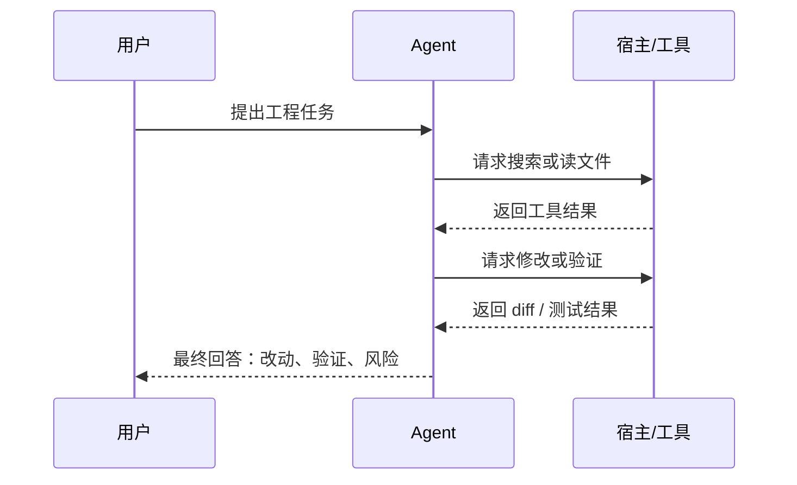

| 返回类型 | 含义 |
|---|---|
| 普通文本 | 直接解释、总结、给方案 |
| 工具调用请求 | 请求宿主执行 shell、读文件、写文件、搜索、测试 |
| 中间状态说明 | 宿主或 Agent UI 告诉用户当前正在分析、编辑或验证 |
| 最终回答 | 说明结果、验证、风险和后续建议 |

工具调用本身不是模型直接在系统里执行命令，而是模型向宿主发出结构化请求；宿主按权限和实现执行后，把结果作为新的上下文再交还给模型。对有副作用的工具，宿主还应负责审批、隔离、日志和失败处理。

简化流程如下：

```text
1. 用户：修复登录按钮样式
2. Agent：我要先搜索登录按钮组件
3. 宿主：执行 rg / Get-Content 等工具
4. Agent：根据文件内容判断要改哪里
5. 宿主：应用补丁
6. Agent：运行相关测试或检查
7. 宿主：返回测试结果
8. Agent：整理最终回答
```

### 4.4 Agent 请求与返回的伪结构

从工程视角看，一次 Agent 请求可以理解成一个结构化对象。真实实现不一定长这样，但这个伪结构能帮助理解：

```json
{
  "system_rules": [
    "你是编码 Agent",
    "不要泄露密钥",
    "遵守工具调用约束"
  ],
  "developer_rules": [
    "先读代码再改",
    "最小必要改动",
    "最终回答说明验证情况"
  ],
  "project_rules": [
    "输出使用中文",
    "代码审核优先使用 codex xhigh review --commit <commit-sha> 审核被审提交"
  ],
  "user_task": "写一个页面版 LLM、Agent 和记忆系统使用手册",
  "retrieved_memory": [
    "项目私有层默认写入 .codex/memories",
    "项目共享层使用 .codex/shared"
  ],
  "workspace_evidence": [
    "docs/USER_GUIDE.md 已存在",
    "docs/MEMORY_RETRIEVAL_STRATEGY.md 已说明向量库策略"
  ],
  "available_tools": [
    "shell",
    "apply_patch",
    "update_plan"
  ]
}
```

模型的返回也可以理解成几类。第一类是工具调用意图：

```json
{
  "type": "tool_call",
  "tool": "apply_patch",
  "reason": "需要新增一篇 Markdown 手册",
  "expected_observation": "文件创建成功，或返回补丁失败原因"
}
```

第二类是最终交付回答：

```json
{
  "type": "final_answer",
  "summary": "已新增手册并更新 README 入口",
  "verification": "已检查 Markdown diff 和空白",
  "risk": "未运行单元测试，因为只改文档"
}
```

这能解释一个常见现象：Agent 有时不会马上给最终答案，而是先调用工具。因为代码任务需要用真实文件、真实测试和真实 git 状态来闭环。

### 4.5 Agent 为什么需要上下文管理

因为 Agent 每一步都要把“当前知道什么”放回上下文里。如果上下文管理不好，会出现：

- 忘记用户最初的约束。
- 重复读取无关文件。
- 把旧工具输出当成最新状态。
- 测试失败后没有把失败原因带入下一轮。
- 在多项目 workspace 中改错项目。
- 最终回答没有说明验证证据。

所以成熟工程 Agent 通常需要外部状态系统，记录任务目标、约束、工作集、工具事件、验证结果和下一步。

外部状态系统不是让模型绕过 token 限制。它的作用是先在模型外保存和整理状态，再把本轮真正需要的部分放回上下文。

### 4.6 Agent 工作中最容易出错的环节

逐点看，Agent 的错误通常不是“模型完全不会”，而是上下文、工具和状态之间断开。

| 环节 | 可能出错 | 需要什么机制 |
|---|---|---|
| 理解任务 | 把用户目标理解窄了或宽了 | 任务目标、验收标准、澄清问题 |
| 选择上下文 | 读了无关文件，漏了关键规则 | 检索、路由、context pack |
| 调用工具 | 工具失败但继续按成功推理 | 工具结果检查、失败记录 |
| 修改文件 | 改动越界或覆盖用户改动 | working set、scope guard、git 状态 |
| 验证结果 | 没运行测试却说完成 | verification profile、结果回写 |
| 最终回复 | 没说明风险和未验证项 | before_response 汇总 |
| 长期沉淀 | 把敏感日志或低置信结论写入记忆 | 脱敏、分层、共享记忆 review |

本节校正依据（2026-05-06 只读核对）：

- OpenAI Agents SDK：`https://platform.openai.com/docs/guides/agents-sdk`
- OpenAI Function Calling / Tools：`https://platform.openai.com/docs/guides/function-calling`
- OpenAI Codex：`https://platform.openai.com/docs/codex`
- LangChain Agents：`https://docs.langchain.com/oss/python/langchain/agents`
- LangChain Context Engineering：`https://docs.langchain.com/oss/python/langchain/context-engineering`

## 5. 用 Codex 解释 Agent 工作原理

本节校正依据（2026-05-06 只读核对）：OpenAI Codex、Codex Best Practices 与 Codex Hooks 文档：`https://platform.openai.com/docs/codex`、`https://developers.openai.com/codex/learn/best-practices`、`https://developers.openai.com/codex/hooks`

### 5.1 Codex 在工程任务中的典型循环

在 Codex 这类 coding agent 里，一个代码任务通常经历这些阶段：

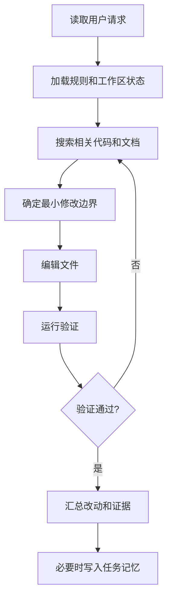

```text
1. 读取用户请求
2. 读取系统规则、项目规则和工作区状态
3. 搜索相关代码和文档
4. 制定最小必要修改边界
5. 编辑文件
6. 运行测试、验证脚本或静态检查
7. 根据失败结果继续修正
8. 汇总改动和验证证据
9. 必要时沉淀任务总结
```

这说明 Codex 的价值不只是“生成代码”，而是把模型推理、受控工具调用和工程验证组织成一个闭环。具体能否编辑、运行命令或联网，还取决于当前宿主、sandbox、审批策略和项目规则。

### 5.2 Codex 的请求上下文大概长什么样

一次 Codex 推理前，宿主实际发送给模型的内部格式不一定公开；从工程协作角度看，上下文可能类似这样：

```text
系统规则：
- 你是一个编码 Agent
- 不能泄露密钥
- 编辑文件要遵守工具规则

开发者规则：
- 先读代码再改
- 尽量最小改动
- 有测试就运行
- 最终回答要说明验证情况

项目规则：
- 输出使用中文
- 回复开头必须有“前置说明”
- 代码审核优先使用 codex xhigh review --commit <commit-sha> 审核被审提交

用户任务：
- 写一个页面版使用手册，细化 Token、Agent、记忆和 Codex 工作原理

工作区证据：
- docs/USER_GUIDE.md 已存在
- docs/MEMORY_LAYERING.md 已说明记忆分层
- docs/MEMORY_RETRIEVAL_STRATEGY.md 已说明 RAG/向量库策略

可用工具：
- shell
- apply_patch
- update_plan
- ...
```

模型基于这些内容判断下一步：是继续读文档、创建新文件、修改现有文件，还是先向用户确认。

这里每一行都会进入 token 预算。宿主越能提前筛选和摘要，模型越容易把注意力放在真正影响当前任务的证据上。

### 5.3 Codex Memory Harness 的 context pack 是什么

这里的 `context pack` 是本项目 Codex Memory Harness 的上下文装配包，不是官方 Codex 文档中可确认的通用术语。它可以理解成“本次推理要带给模型的一包上下文”。它不是把所有历史都带上，而是把当前最相关的材料按优先级装配。

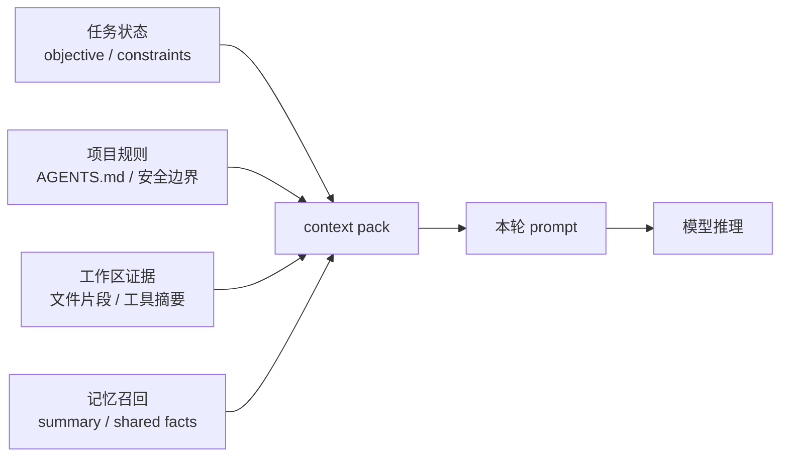

从 token 角度看，context pack 是一次预算分配。任务目标、硬约束和最新工具结果优先；低置信、过期或只作为背景的信息应该压缩、延后或不放入本轮请求。

一个合理的 context pack 通常包含：

| 内容 | 例子 | 优先级 |
|---|---|---|
| 当前任务状态 | objective、constraints、next step | 最高 |
| 项目硬规则 | `AGENTS.md`、安全边界、输出语言 | 高 |
| 当前工作集 | touched paths、相关模块 | 高 |
| 最近工具摘要 | 刚刚失败的测试、搜索命中 | 高 |
| 项目共享事实 | `.codex/shared` 中 accepted 结论 | 中高 |
| 历史任务总结 | 类似问题的 summary | 中 |
| 低置信草稿 | 未 review 的发现 | 低，只能参考 |

这样做的目的有三个：

- 减少 token 浪费。
- 降低无关历史干扰。
- 让模型知道哪些信息更可信。

### 5.4 工具调用结果如何回到模型

当 Codex 这类 Agent 请求工具后，宿主或 hook runtime 会把工具结果摘要重新放回后续上下文。例如：

```text
工具请求：
读取 docs/MEMORY_LAYERING.md 前 220 行

工具返回：
- 官方 Codex Memories 保留给官方目录
- Harness 用户全局层放在 ~/.codex/codex-memory-harness/memories
- 项目私有层放在 .codex/memories
- 项目共享层放在 .codex/shared
```

模型不会自动“知道”工具执行结果，必须由宿主把结果作为新的消息或事件摘要交回模型。然后模型才能继续判断：

```text
这篇新手册应引用现有记忆分层策略，避免重复定义不同术语。
```

### 5.5 工具返回不等于可信事实

工具返回是证据，但不总是最终事实。Agent 还需要判断：

- 命令是否成功退出。
- 输出是否完整。
- 是否超时。
- 是否只覆盖了部分文件。
- 是否是旧状态。
- 是否包含敏感信息，不能写入记忆。
- 是否需要再次验证。

例如测试命令失败时，正确处理不是简单说“测试失败”，而是记录：

```text
命令：python -X utf8 -m unittest discover -s tests
结果：失败
失败摘要：test_hook_bridge_task_mapping 中 expected event 不一致
下一步：读取相关测试和 hook_bridge 映射逻辑
```

这类摘要可以进入任务状态。完整日志通常不应进入长期记忆。

### 5.6 为什么 Codex 需要最终回答

最终回答不是礼貌性总结，而是工程交付的一部分。它应告诉用户：

- 改了哪些文件。
- 为什么这样改。
- 运行了哪些验证。
- 哪些验证没能运行。
- 是否存在未解决风险。
- 是否创建了 commit。

如果没有最终回答，用户很难判断 Agent 的工作是否真的闭环。

本节校正依据（2026-05-06 只读核对）：

- OpenAI Codex：`https://platform.openai.com/docs/codex`
- OpenAI Codex Best Practices：`https://developers.openai.com/codex/learn/best-practices`
- OpenAI AGENTS.md：`https://developers.openai.com/codex/guides/agents-md`
- OpenAI Codex Hooks：`https://developers.openai.com/codex/hooks`
- OpenAI Codex Approvals and Security：`https://developers.openai.com/codex/agent-approvals-security`
- 本项目实现：`plugins/codex-memory/scripts/context_builder.py`
- 本项目实现：`plugins/codex-memory/scripts/hook_runner.py`

## 6. 三种记忆：临时记忆、工程记忆、经典 RAG

本节校正依据（2026-05-06 只读核对）：OpenAI Memory FAQ、OpenAI Codex Memories 与 RAG 论文：`https://help.openai.com/en/articles/8590148-memory-in-chatgpt`、`https://developers.openai.com/codex/memories`、`https://arxiv.org/abs/2005.11401`

### 6.1 临时记忆是什么

临时记忆通常指当前对话上下文里的信息。

例如用户刚刚说：

```text
这个项目输出统一用中文。
```

只要这句话还在当前上下文里，模型就能遵守。但如果换一个窗口、上下文被压缩、历史被裁剪，模型未必还能稳定记得。

临时记忆的特点：

| 特点 | 说明 |
|---|---|
| 生命周期短 | 主要存在于当前会话或当前上下文窗口 |
| 速度快 | 不需要检索，直接在 prompt 中 |
| 成本高 | 占用 token 预算 |
| 不稳定 | 长任务、换窗口、压缩后可能丢失 |
| 不可审计 | 很多内容只存在于对话里，不一定落盘 |

临时记忆适合保存：

- 当前这一步的需求。
- 刚刚读到的错误信息。
- 刚刚执行的工具结果。
- 当前短任务的临时假设。

不适合保存：

- 长期项目规则。
- 团队共享决策。
- 多天任务状态。
- 验证历史和发布证据。

### 6.2 当前这种记忆系统是什么

这里的“当前这种记忆系统”指 Codex Memory Harness 的工程记忆。

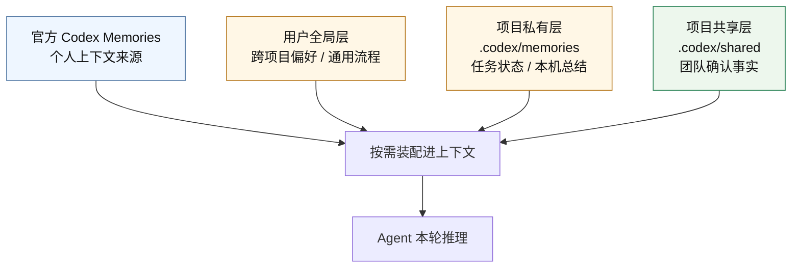

它不是把所有聊天记录塞进模型，也不是让模型自己“永久记住”。它是在本机文件系统里保存结构化任务状态和可审查总结。

它主要保存：

- 当前任务目标。
- 用户和项目约束。
- 工作集和 touched paths。
- 工具事件摘要。
- 验证结果摘要。
- 任务完成 summary。
- 可提升为共享记忆的事实、决策和流程。

它的关键点是：

```text
记忆在模型外部，写入位置可控，读取时按任务需要装配进上下文。
```

Codex Memory Harness 的分层如下：

| 层级 | 位置 | 是否提交 | 用途 |
|---|---|---|---|
| 官方 Codex Memories | `$CODEX_HOME/memories` | 不提交 | 官方自动生成的个人长期记忆 |
| 用户全局层 | `$CODEX_HOME/codex-memory-harness/memories` | 不提交 | 跨项目偏好、通用工作流 |
| 项目私有层 | `<项目根目录>/.codex/memories` | 不提交 | 当前项目本机任务状态和总结 |
| 项目共享层 | `<项目根目录>/.codex/shared` | 可提交，需审查 | 团队确认的事实、决策和流程 |

官方 Codex Memories 和 Chronicle 这类官方能力只作为个人上下文来源；它们不能覆盖本次用户要求、项目 `AGENTS.md`、安全规则或已 review 的项目共享事实。

### 6.3 经典记忆：RAG 是什么

RAG 是 Retrieval-Augmented Generation 的缩写，通常翻译为“检索增强生成”。

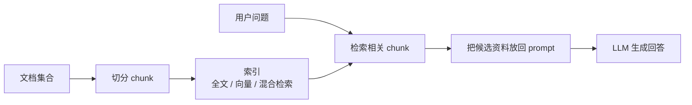

它的基本思路是：

```text
用户提问 -> 检索相关资料 -> 把资料片段放入 prompt -> LLM 基于资料回答
```

典型 RAG 流程：

```text
1. 收集文档
2. 切分文档为 chunk
3. 为 chunk 建立索引
4. 用户提问时检索相关 chunk
5. 把 chunk 放入模型上下文
6. 模型根据 chunk 生成回答
```

很多 RAG 系统会使用向量数据库，但 RAG 不等于向量数据库。检索层也可以来自全文搜索、关系数据库、结构化查询、API、知识图谱或混合检索。向量数据库的常见做法是把文本 chunk 转换成 embedding，用语义相似度检索相关内容。

这里的 embedding 是“用于检索的文本向量”，不等于 token 本身。RAG 先用 embedding 找到可能相关的 chunk，再把选中的 chunk 作为文本放回 prompt。放回 prompt 后，它仍然会重新消耗 token。

### 6.4 RAG 的优势和问题

RAG 的优势：

- 适合知识库问答。
- 适合大量文档检索。
- 能用自然语言找相似主题。
- 可以减少把全部文档塞进上下文的成本。

RAG 的问题：

- 需要切分策略，chunk 太大或太小都会影响效果。
- embedding、重排器、向量库或外部检索服务会增加依赖。
- 检索结果可能相似但不准确。
- 语义相似不等于任务正确，尤其是路径、版本和当前状态有变化时。
- 对代码任务来说，路径、符号、错误信息有时比语义相似度更重要。
- 敏感信息进入索引后，删除和审计都更复杂。
- 召回结果必须带来源，否则用户难以判断可信度。

### 6.5 三种记忆的对比

| 记忆类型 | 存在哪里 | 解决什么 | 主要风险 |
|---|---|---|---|
| 临时记忆 | 当前上下文窗口 | 当前对话连续性 | 易丢失、占 token、不可审计 |
| 工程记忆 | 本机 `.codex`、SQLite、JSONL、Markdown | 任务状态、验证、项目规则和沉淀 | 需要分层、脱敏和边界控制 |
| RAG 记忆 | 文档索引、全文索引、向量库 | 大规模知识召回 | 误召回、索引污染、敏感信息治理 |

Codex Memory Harness 当前优先做工程记忆，并保留 exact/fulltext 检索能力。向量检索当前不是默认能力，而是未来可选增强。

本节校正依据（2026-05-06 只读核对）：

- OpenAI Memory FAQ：`https://help.openai.com/en/articles/8590148-memory-in-chatgpt`
- Lewis et al., Retrieval-Augmented Generation for Knowledge-Intensive NLP Tasks：`https://arxiv.org/abs/2005.11401`
- 本项目策略：`docs/MEMORY_RETRIEVAL_STRATEGY.md`
- 本项目策略：`docs/MEMORY_LAYERING.md`

### 6.6 逐点判断该用哪种记忆

可以按问题类型选择记忆方式：

| 问题 | 更适合的记忆 | 原因 |
|---|---|---|
| 用户刚刚说了什么 | 临时记忆 | 当前上下文里最准确 |
| 这个任务现在做到哪一步 | 工程记忆 | 需要 task state 和 checkpoint |
| 这次改了哪些文件 | 工程记忆 | 需要 touched paths |
| 哪个测试刚失败 | 工程记忆 | 需要工具结果摘要 |
| 团队确认过的架构决策是什么 | 项目共享记忆 | 需要可审查、高置信事实 |
| 之前类似问题怎么解决 | RAG 或全文检索 | 需要历史 summary 和文档召回 |
| 用户跨项目长期偏好是什么 | 用户全局层 | 需要跨项目复用 |
| 官方 Codex 自动记住的个人偏好是什么 | 官方 Codex Memories | 由官方机制管理，只作个人上下文参考 |
| 本轮到底应该带哪些材料进模型 | Codex Memory Harness context pack | 需要在 token 预算内装配证据 |

简单规则：

```text
当前对话用临时记忆，当前任务用工程记忆，历史知识召回用 RAG/全文检索，团队事实用项目共享记忆。
```

## 7. 为什么不是直接把所有东西都放进 RAG

本节校正依据（2026-05-06 只读核对）：OpenAI Codex Memories、Chronicle 与 RAG 论文：`https://developers.openai.com/codex/memories`、`https://developers.openai.com/codex/memories/chronicle`、`https://arxiv.org/abs/2005.11401`

代码 Agent 的很多信息不是普通知识库问答。

例如：

```text
刚才哪个测试失败了？
这次任务改了哪些文件？
用户要求不要碰哪些目录？
当前 route plan 绑定了哪个子项目？
review gate 是否已经通过？
```

这些问题依赖结构化任务状态，而不是只靠语义相似度或知识召回。即使 RAG 能召回相关文字，也不能自动证明当前工作区已经修改、测试或 review 通过。

因此 Codex Memory Harness 当前更重视：

- 任务生命周期。
- 工具事件。
- 文件路径。
- 验证结果。
- scope guard。
- review gate。
- 可审查 Markdown 共享记忆。

RAG 更适合回答：

```text
之前类似安装器问题怎么处理？
项目里关于客户端登录契约有哪些历史决策？
团队有没有写过发布回滚流程？
```

两者不是替代关系：

```text
工程记忆负责“当前任务怎么可靠推进”，RAG / 全文检索负责“历史知识怎么召回”。
```

召回后的历史知识仍然只是候选上下文。Agent 需要把它和当前文件、工具输出、验证结果放在一起判断。

本节校正依据（2026-05-06 只读核对）：

- OpenAI Codex Memories：`https://developers.openai.com/codex/memories`
- OpenAI Codex Chronicle：`https://developers.openai.com/codex/memories/chronicle`
- OpenAI Memory FAQ：`https://help.openai.com/en/articles/8590148-memory-in-chatgpt`
- Lewis et al., Retrieval-Augmented Generation for Knowledge-Intensive NLP Tasks：`https://arxiv.org/abs/2005.11401`
- AWS SageMaker RAG：`https://docs.aws.amazon.com/sagemaker/latest/dg/jumpstart-foundation-models-customize-rag.html`
- AWS Bedrock Knowledge Bases：`https://docs.aws.amazon.com/bedrock/latest/userguide/kb-how-retrieval.html`
- IBM RAG Vector Databases：`https://www.ibm.com/think/topics/rag-vector-database`
- 本项目策略：`docs/MEMORY_RETRIEVAL_STRATEGY.md`
- 本项目策略：`docs/MEMORY_LAYERING.md`

### 7.1 经典 RAG、长上下文和 Harness 的区别

除了 RAG，现在还常见一种思路：直接使用超长上下文，把大量文件和历史都放进模型。

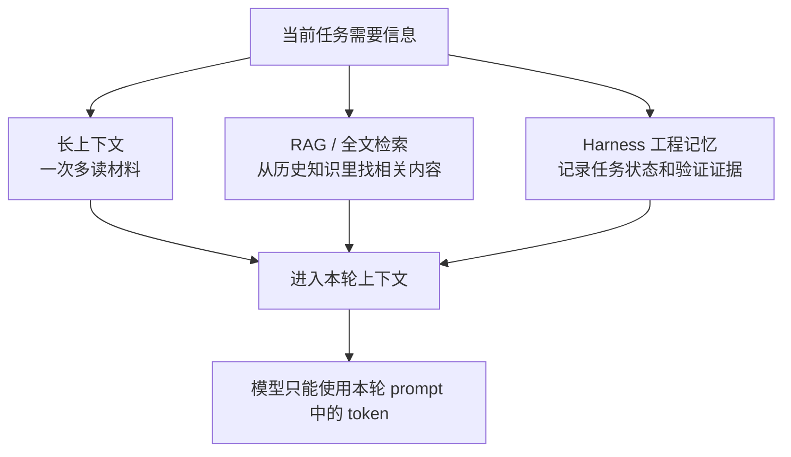

三种方式的边界如下：

| 方式 | 适合 | 不适合 |
|---|---|---|
| 长上下文 | 一次性阅读大量材料、做整体理解 | 高频任务状态、长期审计、敏感日志治理 |
| RAG | 从大量文档里找相关知识 | 精确任务状态、测试结果、当前工作集 |
| Harness 工程记忆 | 跟踪任务、工具、验证和沉淀 | 替代大规模语义知识库 |

最稳妥的组合是：

```text
长上下文负责本次阅读容量，RAG 负责历史知识召回，Harness 负责任务状态和工程闭环。
```

三者最终都会回到同一个约束：本次推理只能使用放进当前上下文的 token。差别在于它们各自负责“读多少”“找什么”和“记录什么”。

## 8. Codex Memory Harness 的 3W1H

本节校正依据（2026-05-06 只读核对）：项目 README 与用户指南：`README.md`、`docs/USER_GUIDE.md`

### 8.1 Why：为什么需要它

因为 Agent 在工程任务中容易遇到这些问题：

- 换窗口后上下文断裂。
- 长任务中早期约束丢失。
- 工具执行结果没有沉淀。
- 任务验证和最终回答脱节。
- 多项目 workspace 容易改错边界。
- SubAgent 分工没有统一 scope。
- 项目规则、个人偏好和团队事实混在一起。
- 原始日志和敏感信息容易污染长期记忆。

Codex Memory Harness 用本机外部记忆和 harness 生命周期来解决这些问题。

### 8.2 What：它是什么

它是一个本地工具包，不是一个新模型。

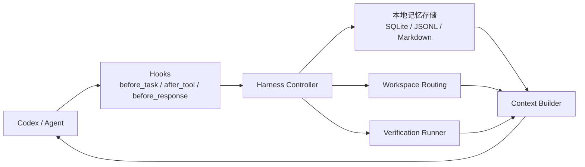

它提供：

- 本地 memory 存储。
- Codex hook 生命周期桥接。
- 任务 start/checkpoint/complete。
- context pack 构建。
- workspace routing。
- SubAgent binding 和 dispatch plan。
- verification aggregation 和基础 release gate。
- 写入前敏感信息扫描与脱敏。
- review gate 工作流。
- 项目共享记忆提升流程。

当前它不提供真实 SubAgent 自动执行器、向量数据库、发布级完整验证平台或 eval replay 平台，也不会按 workspace route 自动把子项目事实分层写入长期 memory。

workspace routing 已能记录 route plan、bindings 和 runtime decision；长期共享仍要通过 summary 与 `codex memory promote` 做审查式提升。

### 8.3 Who：谁应该使用

适合：

- 经常用 Codex 处理同一个项目的人。
- 需要跨窗口延续任务上下文的人。
- 需要记录验证证据和任务总结的人。
- 有多项目 workspace、SubAgent 或发布 gate 的团队。
- 希望把项目事实和个人偏好分层管理的人。

不适合：

- 只做一次性问答。
- 不希望本机写入任何项目状态。
- 想把所有内容无差别长期保存。
- 期望工具替代人工代码审查和发布判断。

### 8.4 How：如何使用

首次安装：

```powershell
.\install.bat
```

检查安装：

```powershell
codex memory doctor
codex memory check-install
```

日常使用：

```powershell
codex
```

显式 memory wrapper：

```powershell
codexm
```

绕过 wrapper：

```powershell
codex-raw
```

初始化当前项目：

```powershell
codex memory init
```

运行项目验证：

```powershell
codex harness verify run --profile primary
```

代码审核 gate：

```powershell
codex xhigh review --commit <commit-sha>
```

本节校正依据（2026-05-06 只读核对）：

- 项目 README：`README.md`
- 用户指南：`docs/USER_GUIDE.md`
- Hook lifecycle：`plugins/codex-memory/scripts/hook_runner.py`
- Harness controller：`plugins/codex-memory/scripts/harness_controller.py`

## 9. 一次带记忆的 Codex 任务如何运行

本节校正依据（2026-05-06 只读核对）：项目 README 与 hook lifecycle 实现：`README.md`、`plugins/codex-memory/scripts/hook_runner.py`

下面用一条任务拆解完整流程。

这一节关注的不是模型“记住了什么”，而是每个生命周期事件如何把任务状态整理到模型外部。后续需要时，再把摘要装配回当前上下文。

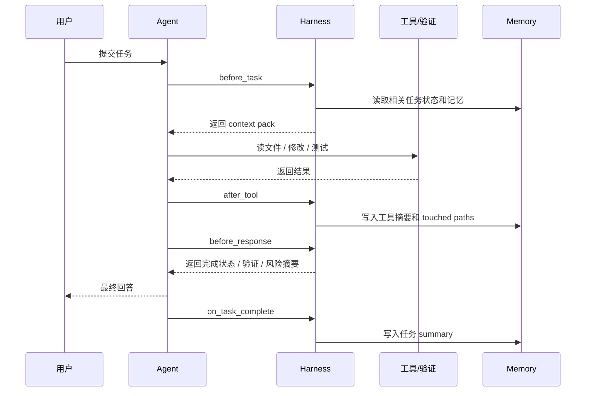

用户输入：

```text
修一下活动入口，客户端入口要按服务端配置显示，后台配置页也同步一下。
```

### 9.1 before_task：任务开始前

Memory Harness 应先整理任务上下文：

- 当前 cwd 是哪个项目。
- 用户任务是什么。
- 是否是跨项目任务。
- 需要读取哪些项目规则。
- 是否存在相关历史 summary。
- 是否需要 workspace route plan。
- 是否建议 SubAgent 分工。

输出可能包括：

```text
task_id: 20260505-activity-entry
objective: 修复活动入口配置链路
constraints:
  - 不泄露敏感信息
  - 最小必要改动
working_set:
  - client/**
  - server/**
  - admin/**
route_plan:
  - game_client
  - game_server
  - backoffice_web
```

这些信息会成为 Agent 后续行动的上下文。它们通常比完整历史更适合放入本轮 prompt，因为它们更短、更明确，也更接近当前目标。

### 9.2 after_tool：工具调用后

每次读文件、搜索、修改、测试后，Harness 可以记录摘要：

```text
tool: rg
purpose: 搜索活动入口配置
result_summary:
  - 找到客户端入口组件
  - 找到服务端配置字段
  - 后台配置页存在对应表单
touched_paths:
  - client/...
  - server/...
```

注意这里记录的是摘要，不应该把完整日志、密钥、令牌或大量原始输出写入记忆。摘要既能降低 token 成本，也能减少敏感信息长期留存。

### 9.3 before_response：回复前

在最终答复前，Harness 可以整理：

- 当前任务是否完成。
- 修改了哪些路径。
- 路由是否越界。
- 验证是否执行。
- 是否存在未启动 SubAgent 的原因。
- 是否存在未解决风险。

这样最终回答不是凭印象写，而是基于结构化任务状态写。模型只需要拿到完成状态、验证摘要和风险摘要，不需要重新读取所有过程日志。

### 9.4 on_task_complete：任务完成后

任务显式完成后，Harness 可以写入 summary。当前 hook 映射里，普通 `Stop` 会进入 `before_response` 做回复前整理；只有显式完成事件或 `codex harness complete` 才进入 `on_task_complete`：

```text
完成内容：
- 客户端活动入口改为按服务端配置显示
- 后台配置页同步新增开关
- 相关验证通过

验证：
- client_quick passed
- server_unit passed
- admin_lint_test passed

可沉淀结论：
- 活动入口显示逻辑以服务端配置为准
- 后台配置变更需要同步客户端验证 profile
```

如果这些结论稳定、脱敏、适合团队共享，可以再提升到 `.codex/shared`。提升前应确认它们不是临时猜测，也不包含只属于本机运行态的信息。

### 9.5 生命周期逐点核对表

| 阶段 | Agent 要知道什么 | Harness 应记录什么 | 不应记录什么 |
|---|---|---|---|
| before_task | 用户目标、项目规则、相关记忆 | objective、constraints、working set、route plan | 密钥、原始日志 |
| after_tool | 工具是否成功、结果意味着什么 | tool name、结果摘要、touched paths、失败摘要 | 大段原始输出、敏感字段 |
| before_response | 是否完成、是否验证、是否越界 | routing review、verification summary、risk | 未确认事实当成结论 |
| on_task_complete | 哪些结论值得沉淀 | task summary、验证状态、候选共享事实 | 低置信猜测、私有运行态 |

这张表可以作为页面版手册的核心检查清单。用户不需要理解所有内部实现，也能判断一次 Agent 任务是否闭环。

本节校正依据（2026-05-06 只读核对）：

- 项目 README：`README.md`
- Hook lifecycle：`plugins/codex-memory/scripts/hook_runner.py`
- Harness controller：`plugins/codex-memory/scripts/harness_controller.py`
- Hook mapping tests：`tests/test_hook_bridge.py`
- Hook task mapping tests：`tests/test_hook_bridge_task_mapping.py`
- Workspace hook tests：`tests/test_workspace_hook_integration.py`
- 官方 Codex Hooks：`https://developers.openai.com/codex/hooks`

## 10. 页面版阅读结构建议

如果这篇手册作为网页或文档站页面，建议页面结构如下：

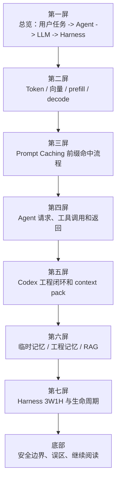

页面版优先把图放在对应概念第一次出现的地方，而不是集中放到最后。读者应该能按下面顺序逐步建立心智模型：

| 阅读顺序 | 图解模块 | 解决的问题 |
|---|---|---|
| 1 | 总览图 | LLM、Agent、工具和 Harness 的总体关系 |
| 2 | Token 到输出流水线 | Token、向量、prefill、decode 分别在哪里 |
| 3 | Token 预算分布图 | 为什么上下文窗口不是无限材料箱 |
| 4 | Prompt Caching 命中图 | 为什么稳定前缀要放前面、动态内容要放后面 |
| 5 | Agent sequence diagram | 工具调用为什么不是模型自己执行命令 |
| 6 | context pack 图 | Harness 如何把任务状态和证据装配回 prompt |
| 7 | 记忆分层图 | 官方记忆、用户全局、项目私有和项目共享怎么分层 |
| 8 | 生命周期图 | before_task、after_tool、before_response、on_task_complete 各自做什么 |

## 11. 常见误区

本节校正依据（2026-05-06 只读核对）：前文 Token、Prompt Caching、RAG 与项目隐私边界依据：`https://developers.openai.com/api/docs/guides/prompt-caching`、`https://arxiv.org/abs/2005.11401`、`docs/PRIVACY.md`、`docs/MEMORY_LAYERING.md`

### 11.1 误区：Token 就是词向量

不是。Token 是 tokenizer 切出的离散文本单位，词向量或 embedding 是后续计算里的数值表示。语义相近的词不一定共享 token，例如 `苹果` 和 `apple` 通常会被编码成不同 token。

### 11.2 误区：记忆就是把聊天记录全保存

不是。工程记忆应该保存最小必要摘要、任务状态、验证证据和可复用结论。原始日志、密钥、生产地址和低置信猜测不应进入长期记忆。

### 11.3 误区：缓存就是记忆

不是。这里的缓存特指 OpenAI Prompt Caching：它复用相同 prompt 前缀的已处理结果，用来降低延迟和输入 token 成本。记忆保存的是任务状态、事实、决策和可审查总结。

Prompt Caching 命中要求请求开头有完全相同的长前缀；它不会保存最终回答，也不能替代记忆系统的选择、摘要、脱敏和审查。

### 11.4 误区：RAG 能解决所有记忆问题

RAG 适合知识召回，但不等于任务状态机。当前任务做到了哪一步、改了哪些文件、验证是否通过，这些更适合结构化 harness 记录。

### 11.5 误区：Agent 会自动知道工具结果

不会。工具结果必须被宿主返回给模型，并进入上下文后，模型才能基于结果继续推理。

### 11.6 误区：上下文越多越好

不是。上下文越多，token 成本越高，噪声也越多。好的 Agent 应该装载相关证据，而不是把整个仓库和所有日志都塞进去。

### 11.7 误区：项目私有记忆可以直接提交

不应该。`.codex/memories` 是本机私有运行态，包含 SQLite、JSONL、summary 和临时发现。团队共享内容应通过 `.codex/shared` 的 Markdown 形式审查后提交。

## 12. 安全边界

任何记忆系统都必须先考虑安全边界。

原因很简单：进入上下文的信息是短期风险，写入外部记忆的信息是长期风险。后者更需要脱敏、分层和审查。

不要写入记忆：

- 密钥。
- 令牌。
- cookie。
- 账号密码。
- 内部链接、私有仓库地址、生产环境地址。
- 原始构建日志。
- 原始用户数据。
- 私有仓库敏感路径。
- 大段原文或版权受限内容。
- 未审查的低置信结论。

推荐写入记忆：

- 脱敏后的任务摘要。
- 验证命令和结果状态。
- 已确认的项目规则。
- 可复用的修复模式。
- 团队 review 过的架构决策。

安全边界也适用于 RAG 和向量索引。敏感文本一旦进入索引，即使原文删除，索引和摘要仍可能残留。

本节校正依据（2026-05-06 只读核对）：

- 项目隐私说明：`docs/PRIVACY.md`
- 项目记忆分层策略：`docs/MEMORY_LAYERING.md`
- 项目检索策略：`docs/MEMORY_RETRIEVAL_STRATEGY.md`
- OWASP LLM09:2025 Misinformation：`https://genai.owasp.org/llmrisk/llm092025-misinformation/`

## 13. 逐点核对清单

写页面版手册时，可以按下面清单检查是否讲清楚。

| 核对点 | 应该讲清楚什么 | 当前页面位置 |
|---|---|---|
| Token | Token 是离散文本单位和预算单位，不是词向量；上下文、工具结果和最终回答都会占 token | 第 2 节 |
| 处理链路 | 原始文本、tokenizer、token id、向量表示、Transformer 推理和输出分别使用哪些技术 | 第 2 节 |
| 向量表示 | token id 进入模型后会映射成向量；RAG embedding 用于检索，不等于 token 本身 | 第 2、6 节 |
| OpenAI Prompt Caching | 相同 prompt 前缀会被自动复用，1024 tokens 起生效，可通过 `usage.prompt_tokens_details.cached_tokens` 观测命中量；它不缓存最终回答，也不等于记忆 | 第 2 节 |
| Prefill | prefill 是整段 prompt 先过模型并生成可复用内部状态，不是最终回答缓存 | 第 2 节 |
| LLM | LLM 根据当前上下文生成，不天然知道本机项目状态，输入输出都受 token 预算限制 | 第 3 节 |
| Agent | Agent 是模型、工具、宿主和任务循环的组合 | 第 4 节 |
| 请求 | 一次请求包含系统规则、项目规则、用户任务、记忆和证据 | 第 4、5 节 |
| 返回 | 返回可能是文本，也可能是工具调用请求 | 第 4 节 |
| Codex | Codex 通过读文件、改文件、运行验证形成工程闭环 | 第 5 节 |
| Context pack | context pack 是本项目把任务状态、规则、证据和记忆装配回上下文的包 | 第 5 节 |
| 临时记忆 | 当前对话里的短期上下文，快但不稳定 | 第 6 节 |
| 工程记忆 | 本机结构化任务状态、验证摘要和项目沉淀 | 第 6、9 节 |
| RAG | 检索历史知识，再放入 prompt 供模型生成 | 第 6、7 节 |
| 3W1H | 为什么需要、它是什么、谁适合、怎么使用 | 第 8 节 |
| 生命周期 | before_task、after_tool、before_response、on_task_complete 各自记录什么 | 第 9 节 |
| 安全 | 不写密钥、令牌、原始日志和低置信结论 | 第 12 节 |

如果后续要把这篇 Markdown 做成真正页面，可以优先把这些核对点做成可视化模块：

- Token / token id / 向量表示关系卡片。
- 文本到输出的技术链路图。
- Token 预算卡片。
- OpenAI Prompt Caching 前缀命中流程图。
- Agent 请求/返回拆解图。
- context pack 装配图。
- 三类记忆对比表。
- Codex 任务生命周期时间线。
- RAG 与 Harness 边界说明。
- 安全红线列表。

## 14. 继续阅读

安装和日常命令：

```text
docs/USER_GUIDE.md
```

记忆分层策略：

```text
docs/MEMORY_LAYERING.md
```

RAG、全文检索和向量数据库策略：

```text
docs/MEMORY_RETRIEVAL_STRATEGY.md
```

SubAgent 工作流：

```text
docs/SUBAGENT_WORKFLOW.md
```

完整开发流程：

```text
docs/FULL_DEVELOPMENT_WORKFLOW.md
```

官方 Codex 对齐策略：

```text
docs/CODEX_OFFICIAL_ALIGNMENT.md
```
