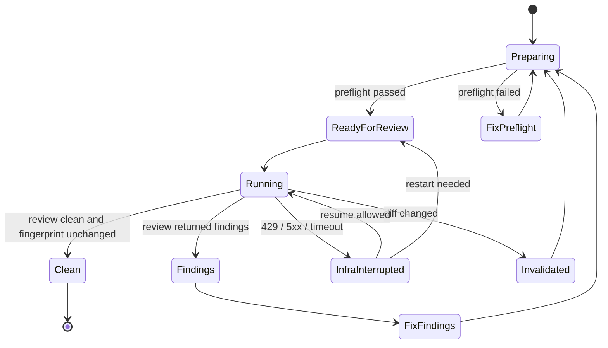

# Review Gate 优化方案

本节校正依据（2026-05-08 本地只读核对）：本方案只细化已有 review gate 设计，当前最终 gate 和 runner 边界见 `docs/SUBAGENT_WORKFLOW.md`、`plugins/codex-memory/scripts/review_gate_runner.py`、`plugins/codex-memory/scripts/xhigh_review_dispatch.py`。

## 方案主体

本节校正依据（2026-05-08 本地只读核对）：最终审核入口、XHigh Review Runner 语义和 runner 恢复策略见 `docs/SUBAGENT_WORKFLOW.md`、`docs/FULL_DEVELOPMENT_WORKFLOW.md`、`plugins/codex-memory/scripts/review_gate_runner.py`、`plugins/codex-memory/scripts/xhigh_review_dispatch.py`。

### 目标

Review gate 优化的目标不是跳过审核，也不是用通用 SubAgent reviewer 替代最终代码审核。目标是缩短“验证 + review + 修复 + 再 review”的总墙钟时间，同时保留最终语义：

```text
代码变更的最终 review gate 改为先创建 candidate commit，记录被审提交 SHA，再运行 `codex xhigh review --commit <commit-sha>`。进入 findings 修复循环后，先修复并创建新的提交，再 review 新提交本身；不要用 `--base` 把整个候选范围反复送审。
```

优化方向分三类：

- 减少送进最终 gate 的噪声 diff。
- 在最终 gate 运行期间并行做不改变 diff 的验证。
- 对 review findings 建立可恢复、可追踪、可复跑的闭环。

### 当前问题

现在耗时主要来自这些点：

| 问题 | 影响 |
|---|---|
| 大 diff 一次性进入 review | 审查上下文变大，超时和漏审概率都上升 |
| review 前缺少准备态检查 | 格式、测试、敏感扫描、构建边界问题会浪费 xhigh 时间 |
| review 结果和 diff 没有强绑定 | review 期间或之后 diff 变化时，容易误把旧结果当新结果 |
| findings 修复后需要重新 review | 正确但耗时，如果没有分层复检，会重复消耗 |
| 基础设施失败与真实 findings 混淆 | 429、5xx、timeout 不能算通过，也不应无脑重开 |

因此优化应围绕“准备态、并行、分片、恢复、证据化”处理，而不是降低 gate 强度。

### 核心原则

1. 最终 gate 不降级。
2. diff 变化会使正在运行或已完成的 review 失效。
3. Review Runner 只执行 Codex CLI review 命令，不修改文件、不提交、不 push。
4. 通用 SubAgent reviewer 只能做专题辅助审查，不替代最终 gate。
5. 基础设施失败不是 review 结果；只有明确 clean 或明确 findings 才是有效结果。
6. 大任务应尽早按 reviewable slice 推进，而不是最后把所有改动一次性塞进 gate。

### Review 准备态

新增 Review Preparedness Gate，目标是在启动 xhigh review 前确认 diff 已经值得审。

建议准备态检查：

| 检查 | 目的 |
|---|---|
| `git diff --check` | 先排除 whitespace 和 patch 结构问题 |
| 配置化 primary/quick verification | 先抓确定性失败，减少 review 发现低级问题 |
| 敏感信息扫描 | 防止 secret、token、内部链接进入 review 和 artifact |
| release/runtime 边界检查 | 防止 `.codex/memories`、`dist`、数据库、日志、缓存进入提交 |
| diff scope 摘要 | 让 reviewer 看到文件数量、风险模块、生成文件和删除文件 |
| diff fingerprint | 把 review 结果绑定到具体 diff |

准备态失败时不启动最终 review gate。先修确定性失败，再进入 xhigh。

### Diff Fingerprint

每次 review runner 启动前生成 `diff_fingerprint`。建议输入：

- `git diff --binary --full-index` 的 hash，用于覆盖 unstaged content。
- `git diff --cached --binary --full-index` 的 hash，用于覆盖 staged content。
- `git status --porcelain=v1` 的 hash。
- 当前 `HEAD`。
- base ref。
- staged / unstaged 模式。

只记录 status 不足以覆盖 staged blob 内容。只要 review 模式允许 staged diff，fingerprint 就必须包含 cached diff 或等价的 staged content hash。

Review 结果必须记录 fingerprint。最终通过条件：

```text
review_result.status == clean
and review_result.diff_fingerprint == current_diff_fingerprint
and verification.status == passed
```

如果 runner 运行中 diff 变化，当前 review 标记为 `invalidated`，不能继续算通过。

### 并行策略

当 diff 已冻结后，可以把耗时工作并行：

| 并行动作 | 要求 |
|---|---|
| XHigh Review Runner | 只读 diff，不修改文件 |
| `git diff --check` | 不改变工作树 |
| 单元测试 / 编译 | 不写入受管源码；若会写缓存，输出目录必须不进入 diff |
| 敏感扫描 | 只读 |
| 打包边界检查 | 只读或写到临时目录 |

如果验证命令会生成源码、锁文件、缓存或构建产物，不能和 review 并行运行在同一个工作树。应先运行，或放进隔离 worktree / 临时输出目录。

### 分片策略

大 diff 不应等到最后才 review。推荐按以下顺序切片：

1. 需求或接口契约。
2. 核心 runtime 代码。
3. 测试和验证脚本。
4. 文档和迁移说明。
5. 安装、打包、release 边界。

每片都要满足：

- 文件集合边界清楚。
- 能独立解释为什么需要改。
- 有对应验证证据。
- review findings 修完后再进入下一片。

最终仍需要对每个候选提交或修复提交运行一次 `codex xhigh review --commit <commit-sha>`。分片 review 的作用是降低单次 commit review 的文件数量和失败率，不是替代最终 gate。

### Runner 恢复策略

XHigh Review Runner 遇到基础设施失败时，优先恢复同一个 runner session：

| 失败类型 | 处理 |
|---|---|
| 429 / 容量 | 退避 20 秒；runner session 仍活跃时发送 continue |
| 5xx / timeout | 退避 2 秒；最多续跑一次 |
| runner 关闭或句柄丢失 | 重新启动同一个 review gate |
| diff 已变化 | 旧 review 作废，重新生成 fingerprint 并重跑 |

恢复同一 session 的原因是保留已读上下文和已形成的审查进度。重开只在不可恢复或 diff 变化时发生。

### Findings 闭环

Review findings 不能只口头记录。建议新增 review ledger：

```json
{
  "review_id": "review-20260508-001",
  "task_id": "review-worktree-plans",
  "diff_fingerprint": "sha256:...",
  "status": "findings",
  "findings": [
    {
      "id": "finding-001",
      "severity": "high",
      "path": "plugins/codex-memory/scripts/example.py",
      "summary": "边界检查在 diff 变化时仍复用旧 review 结果。",
      "resolution": "pending"
    }
  ]
}
```

状态机：



每个 finding 修复后：

1. 记录 touched paths。
2. 跑定向验证。
3. 更新 ledger resolution。
4. 创建新的 candidate commit 或重做未 push 的候选提交，并对新提交运行最终 xhigh review。

### 命令路线

已提供辅助命令：

```powershell
codex review status
codex review preflight --uncommitted
codex review plan --uncommitted
codex review record --result-file review-result.json
codex review findings list
codex review findings resolve <finding-id> --review-id <review-id>
codex review ledger show
```

命令职责：

| 命令 | 职责 |
|---|---|
| `status` | 展示当前 diff fingerprint、最近 review、是否失效 |
| `preflight` | 运行 deterministic checks，不启动模型 review |
| `plan` | 生成 review scope、slice 建议和 runner dispatch plan |
| `record` | 记录 runner 输出、已审 fingerprint、状态、findings 和恢复策略；clean 结果缺少已审 fingerprint 或与当前 diff 不一致时写入 invalidated |
| `findings list` | 查看未修 findings |
| `findings resolve` | 按 review/fingerprint 作用域标记修复证据，但不直接算通过 |
| `ledger show` | 输出审查历史和失效原因 |

### Artifact

当前存储在项目私有 runtime：

```text
.codex/harness/review/
```

至少包含：

- `preflight.json`
- `diff-fingerprint.json`
- `review-ledger.jsonl`
- `runner-dispatch.json`
- `findings.jsonl`

这些文件不提交，不进入 release zip。

### 验收标准

能力完成时至少满足：

1. xhigh review 仍是最终代码审核 gate，但审核对象是单个 commit 引入的变更。
2. review 结果必须和被审 commit SHA 及 commit fingerprint 绑定。
3. 被审 commit 改变后旧 review 自动失效。
4. preflight 失败时不会浪费 xhigh review。
5. runner 可按 429/5xx/timeout 策略恢复或重开。
6. findings 修复后必须重新进入 final gate。
7. 大 diff 能生成 slice 建议和 review plan。
8. 主 agent 可以在 runner 期间并行执行不改变 diff 的验证。

### 分阶段任务

#### Phase RG-1：Review Preparedness

- 新增 preflight 命令。
- 生成 diff scope 摘要。
- 记录 deterministic verification 结果。

#### Phase RG-2：Diff Fingerprint 与 Ledger

- 新增 diff fingerprint。
- review 结果绑定 fingerprint。
- diff 变化时标记旧 review invalidated。

#### Phase RG-3：Runner 编排

- 复用现有 XHigh Review Runner dispatch plan。
- 增加 runner 状态查询和恢复记录。
- 把基础设施失败和真实 findings 分开记录。

#### Phase RG-4：Findings Loop

- 结构化记录 findings。
- 支持 resolve / reopen。
- 修复后自动要求重跑最终 gate。

#### Phase RG-5：Slice Planner

- 根据文件数量、路径、风险、删除/生成文件识别大 diff。
- 输出 reviewable slices。
- 与 session-worktree 绑定协同，必要时在隔离 worktree 中逐片推进。
