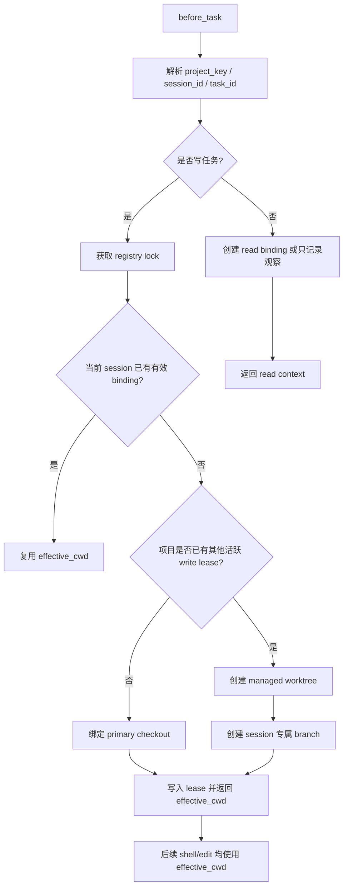
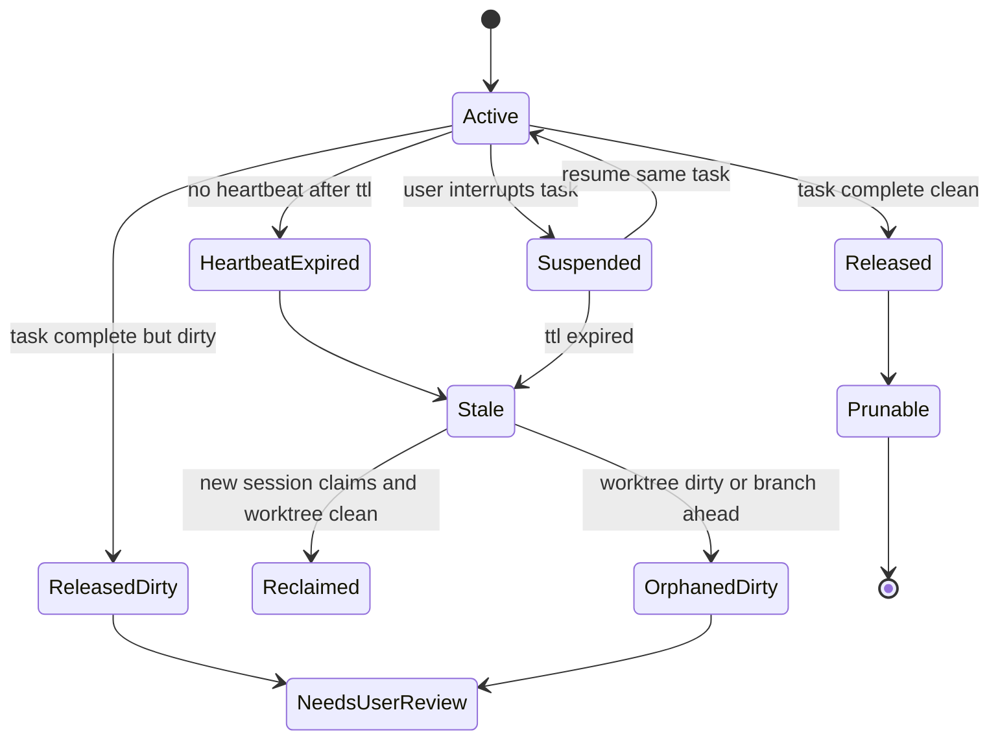

# Session 与 Worktree 绑定方案

## 方案主体

本节校正依据（2026-05-08 本地只读核对）：当前 workspace routing、SubAgent binding、scope guard 和 dispatch plan 的边界见 `docs/WORKSPACE_ADAPTIVE_ROUTING.md`、`docs/SUBAGENT_WORKFLOW.md`、`plugins/codex-memory/scripts/workspace_subagents.py`、`plugins/codex-memory/scripts/subagent_scheduler.py`。

### 目标

Session-worktree 绑定要解决的是并发 Codex session 修改同一个项目时的隔离问题。

目标行为：

- 一个写任务开始时，session 必须关联一个明确 worktree。
- 如果当前项目没有其他活跃写 session，可以直接使用当前 checkout。
- 如果已有活跃 session 绑定该项目，新 session 必须创建或复用自己的隔离 worktree。
- 任务结束时释放绑定。
- session 意外退出、中断、长时间遗忘、多个 session 同任务等情况都有可恢复状态。

这不是 Git worktree 的简单封装，而是 harness lifecycle、workspace routing、SubAgent binding 和 cleanup policy 的统一租约模型。

### 概念模型

| 概念 | 说明 |
|---|---|
| `project_key` | 规范化仓库身份，优先由 Git common dir、主 worktree、remote 摘要派生 |
| `session_id` | Codex session 标识，缺失时由进程、窗口和时间派生降级 ID |
| `task_id` | harness task id；跨轮继续同一任务时复用 |
| `binding_id` | session-task-worktree 的租约 ID |
| `effective_cwd` | 本次任务实际执行命令和编辑的目录 |
| `lease` | 带 heartbeat、过期时间和状态的绑定记录 |
| `managed_worktree` | harness 创建并管理生命周期的隔离 worktree |
| `primary_checkout` | 用户原本进入的项目 checkout，可在单 session 时直接使用 |

绑定记录应存放在用户私有 runtime，而不是提交到仓库：

```text
$CODEX_HOME/codex-memory-harness/worktrees/registry.jsonl
```

项目内 `.codex/harness` 可以只保存策略配置，不保存跨 session 的全局活动租约。原因是多个 worktree 各自有一份工作区文件，不能可靠发现彼此；全局私有 registry 才能判断同一项目是否已有活跃 session。

### 绑定时机

推荐分两级：

| 时机 | 行为 |
|---|---|
| session/window start | doctor 只做只读扫描，发现 stale lease 和可清理 worktree |
| before_task | 根据任务意图申请 read 或 write binding |
| before_first_write | 如果之前是 read binding，升级为 write binding |
| after_tool | heartbeat，并记录 touched paths |
| before_response | 输出当前 binding、有效 cwd、冲突和 stale 提醒 |
| on_task_complete | release binding；按策略清理 clean managed worktree |

读任务不需要独占 worktree。写任务必须获得 write lease。

### 分配算法



默认策略：

- 第一个活跃写 session 使用当前 checkout。
- 第二个及之后的写 session 使用 managed worktree。
- 同一 session 继续同一 task 时复用原 binding。
- 同一 session 开始新写 task 前，如果旧 task 未释放，应先释放；旧 worktree dirty 时保留并提醒。
- 当前 checkout 已 dirty 且 dirty 不是本 session 产生时，新写任务创建 managed worktree。

### Managed Worktree 命名

建议路径：

```text
<repo-parent>/.codex-worktrees/<repo-name>/<task-id>-<session-short>/
```

建议分支：

```text
codex/<task-id>/<session-short>
```

命名要求：

- 只使用安全字符。
- task id 太长时截断并附 hash。
- 不复用其他活跃 session 的分支。
- 不自动删除用户创建的非 managed worktree。

### Lease 状态机



状态含义：

| 状态 | 含义 |
|---|---|
| `active` | session 正在使用该 worktree |
| `suspended` | 用户中断或暂离，短时间内可恢复 |
| `stale` | heartbeat 超时，可由新 session 接管或清理 |
| `released` | 任务完成且 clean |
| `released_dirty` | 任务完成但仍有未提交或未合并改动 |
| `orphaned_dirty` | session 消失且 worktree dirty，不能自动删除 |
| `prunable` | clean、managed、超过保留时间，可安全清理 |

### 意外退出和长时间遗忘

Heartbeat 由 hook lifecycle 自动刷新。建议默认：

- active lease 超过 30 分钟无 heartbeat 标记 `stale`。
- suspended lease 超过 24 小时标记 `stale`。
- clean released managed worktree 保留 7 天后标记为 `prunable`，仍必须通过 dry-run 和 confirm 路径清理。
- dirty / branch ahead worktree 永不自动删除，只进入 `needs_user_review`。

doctor 或 session start 应输出：

- 活跃 bindings。
- stale bindings。
- dirty orphan worktrees。
- 可清理的 clean managed worktrees。

### 一个任务多个 session

一个 task 可以有多个 session，但不能多个 session 共享同一个写 worktree。

推荐模式：

| 场景 | 策略 |
|---|---|
| 主 session + reviewer session | reviewer 用 read binding，不创建写 worktree |
| 多个 implementer 分 scope 并行 | 每个 implementer 一个 managed worktree 和一个 branch |
| coordinator 汇总 | coordinator 不直接改 specialist worktree，负责 merge/review/verification |
| 两个 session 试图写同一 scope | scope guard 阻断或要求 coordinator 决策 |

多 session 同 task 的合并策略：

1. 每个 specialist 在自己的 branch/worktree 完成最小改动。
2. scope guard 检查 touched paths 是否越界。
3. coordinator 按 dependency order 合并到 integration branch 或主任务 worktree。
4. 聚合验证和最终 review gate 只在合并后的稳定 diff 上运行。

### 释放与清理

`on_task_complete` 默认执行 release：

| Worktree 状态 | 动作 |
|---|---|
| clean 且 managed | 标记 `released` 或 `prunable`，只允许在 dry-run 展示后经 confirm 清理 |
| dirty | 标记 `released_dirty`，保留并提醒 |
| branch ahead 且未合并 | 保留，输出 merge/recover 指令 |
| 非 managed primary checkout | 只释放 lease，不删除目录 |
| session crash | 等 heartbeat TTL 后进入 stale 检查 |

自动清理必须满足全部条件：

- path 位于 managed worktree root 下。
- registry 标记 managed。
- `git status --porcelain` clean。
- branch 已合并或无 ahead commit。
- 没有 active lease。
- 不删除 primary checkout。

### 命令路线

建议新增命令：

```powershell
codex workspace session status
codex workspace session bind --task-id <task-id> --mode read|write
codex workspace session heartbeat --binding-id <binding-id>
codex workspace session release --binding-id <binding-id>
codex workspace worktree list
codex workspace worktree prune --dry-run
codex workspace worktree prune --confirm
codex workspace worktree recover <binding-id>
```

`bind` 返回结构化结果：

```json
{
  "binding_id": "bind-review-worktree-plans-abc123",
  "project_key": "sha256:...",
  "session_id": "019e...",
  "task_id": "review-worktree-plans",
  "mode": "write",
  "effective_cwd": "H:/dev/company/.codex-worktrees/codex-memory-harness/review-worktree-plans-abc123",
  "worktree_kind": "managed",
  "branch": "codex/review-worktree-plans/abc123",
  "status": "active"
}
```

主 agent 后续所有 shell、验证、编辑和 review 命令都必须使用 `effective_cwd`。

### 与 Workspace Routing 的关系

Session-worktree binding 是 workspace routing 的执行目录层：

- route plan 决定本次任务涉及哪些项目。
- session-worktree binding 决定每个 route 实际在哪个 checkout 执行。
- SubAgent route binding 决定每个 agent 可改哪些路径。
- scope guard 判断 touched paths 是否越权。
- review gate 在最终 integration worktree 上运行。

在多项目 workspace 中，binding 可以是每个 project 一个 worktree，也可以是整个 mono-repo 一个 worktree。默认先按 Git repository 级别绑定；只有 workspace 配置声明子项目可独立 checkout 时，才按子项目拆分。

### 安全边界

- registry 是用户私有 runtime，不提交。
- 不写入密钥、令牌、内部链接或完整 remote URL；remote 只保存 hash 或脱敏摘要。
- 不自动删除 dirty worktree。
- 不自动删除非 managed worktree。
- 删除前必须解析绝对路径并确认位于 managed root。
- release zip 排除 registry、managed worktree metadata 和 runtime task artifact。

### 验收标准

能力完成时至少满足：

1. 单 session 写任务可直接绑定当前 checkout。
2. 第二个活跃写 session 会自动分配 managed worktree。
3. 同一 session 同一 task 可复用 binding。
4. session crash 后 heartbeat TTL 能标记 stale。
5. dirty stale worktree 不会被自动删除。
6. clean managed worktree 可 dry-run prune，并需要 confirm 才删除。
7. 多 session 同 task 时，每个写 session 有独立 worktree 和 branch。
8. 所有命令返回 `effective_cwd`，后续生命周期使用该目录。
9. scope guard、verification 和 review gate 能关联到 binding。

### 分阶段任务

#### Phase SW-1：Binding Registry

- 新增用户私有 registry。
- 定义 project_key、session_id、task_id、binding_id。
- 实现 file lock 和 heartbeat。

#### Phase SW-2：Worktree Allocator

- 实现 active lease 检测。
- 实现 primary checkout 绑定。
- 实现 managed worktree 创建和 branch 命名。

#### Phase SW-3：Lifecycle 集成

- before_task 申请 read/write binding。
- after_tool heartbeat 和 touched paths。
- before_response 输出 binding 状态。
- on_task_complete release。

#### Phase SW-4：Stale 与 Cleanup

- doctor 展示 stale、dirty orphan、prunable。
- 实现 dry-run prune。
- confirm 后只清理 clean managed worktree。

#### Phase SW-5：多 Session 同 Task

- 和 SubAgent binding / scope guard 联动。
- coordinator 汇总多个 session branch。
- review gate 绑定 integration worktree。
